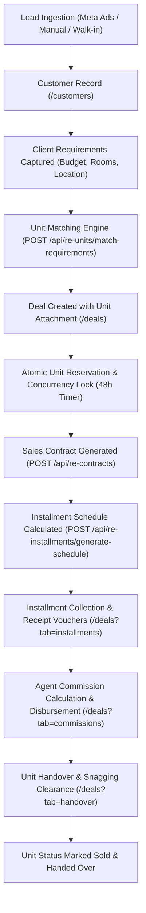
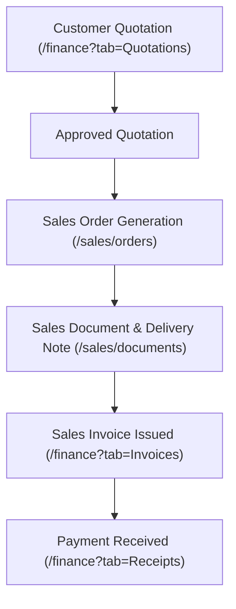
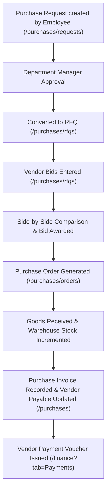
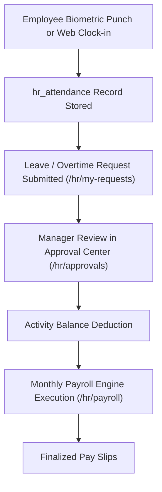
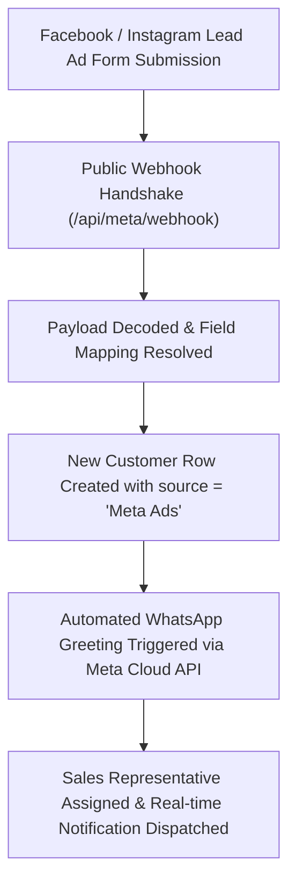

# Tashgheel Project Audit Inventory

**Audit Date:** October 2026 (Live Project Snapshot)  
**System Name:** Tashgheel CRM Online / Multi-Tenant SaaS Platform  
**Audit Type:** Technical, Structural, RBAC, Multi-Tenant Isolation & Functional Read-Only Audit  
**Operating Mode:** Strictly Read-Only (Zero Code Modifications, Zero Refactoring, Zero Deletions)

---

## 1. Project Structure

### 1.1 Repository Root Structure
```
d:\Tashgheel CRM Online\
├── config/                  # Database connection and environment configuration
│   └── db.js                # pg.Pool configuration with SSL and connection pooling
├── controllers/             # 70 Express controllers handling business logic and SQL execution
├── database/                # Base SQL DDL schemas and incremental schema patches
│   ├── migrations/          # 14 raw SQL migration scripts
│   └── schema.sql           # Canonical foundational schema definition (PostgreSQL)
├── frontend/                # React 18 single page application (SPA) bundled with Vite 4
│   ├── public/              # Static public assets
│   ├── src/                 # Application source code
│   │   ├── components/      # Common, Feature, Layout, SubNav, and Wizard components
│   │   ├── context/         # React Contexts (AuthContext, BranchContext, DataContext, LanguageContext)
│   │   ├── hooks/           # Custom hooks (useModule)
│   │   ├── pages/           # 88 Page/View components across 12 business verticals
│   │   ├── services/        # Centralized Axios client (`api.js`) with request/response interceptors
│   │   ├── utils/           # Data sanitizers, Excel export, formatting helpers
│   │   ├── App.jsx          # Declarative router with 90 Route definitions
│   │   └── main.jsx         # React DOM mount entrypoint
│   ├── package.json         # Frontend dependencies and Vite build scripts
│   └── vite.config.js       # Vite build configuration with proxy settings
├── middleware/              # Authentication, Authorization, Scope, and Entitlement guards
│   ├── auth.js              # JWT Bearer verification, tenant_id resolution, template cache
│   ├── branchScope.js       # Triple isolation middleware (Tenant + User + Header + Branch)
│   ├── moduleGuard.js       # Plan-based module access gate (403 module_locked)
│   ├── subscriptionGuard.js # Free trial expiration, plan status, tenant overrides
│   ├── templateGuard.js     # Industry vertical barrier (real_estate vs general)
│   ├── usageLimits.js       # Tier limit enforcement (users, branches, storage)
│   └── secureUploads.js     # File access authorization middleware
├── migrations/              # 7 SQL files tracked by schema_migrations table
├── routes/                  # 67 Express router files (393 endpoints)
├── scripts/                 # 40 administrative, reconciliation, seeding, and migration scripts
├── services/                # 21 backend domain engines and external integrations
├── src/                     # Enterprise Plugin & Modular Architecture
│   ├── application/         # Application command handlers and workflows
│   ├── domains/             # Modular vertical domain packages (realestate, shared)
│   ├── infrastructure/      # Event bus, Outbox engine, tracer, module registry
│   └── shared/              # Cross-cutting enterprise utilities
├── tests/                   # Integration and verification test suites
├── uploads/                 # Local filesystem directory for uploaded documents and logos
├── server.js                # Express 5 server bootstrap, database boot migrations, and route mounts
├── package.json             # Root dependencies (Node.js runtime)
└── PROJECT_AUDIT_INVENTORY.md # This audit report
```

### 1.2 Package & Framework Versions
- **Node.js Environment:** Node.js runtime on Windows x64
- **Backend Framework:** Express `5.2.1`
- **Database Driver:** `pg` `8.20.0`, `pg-hstore` `2.3.4`
- **Security & Utilities:** `jsonwebtoken` `9.0.3`, `bcrypt` `6.0.0`, `helmet` `8.1.0`, `cors` `2.8.6`, `morgan` `1.10.1`, `multer` `2.1.1`, `nodemailer` `8.0.5`, `dotenv` `17.4.1`
- **Frontend Core:** React `18.2.0`, React DOM `18.2.0`
- **Frontend Build Tool:** Vite `4.4.5`
- **Routing:** `react-router-dom` `6.30.3` (inside `frontend/package.json`), `@vitejs/plugin-react` `4.0.3`
- **Styling:** Tailwind CSS `3.4.1`, PostCSS `8.4.35`, Autoprefixer `10.4.18`
- **Icons:** `lucide-react` `1.7.0`
- **Charts & Reports:** `chart.js` `4.5.1`, `react-chartjs-2` `5.3.1`
- **Notifications & Printing:** `react-hot-toast` `2.6.0`, `react-to-print` `3.3.0`
- **HTTP Client:** `axios` `1.14.0`
- **Date Handling:** `date-fns` `4.1.0`

### 1.3 Major Functional Modules
1. **Core SaaS Kernel:** Multitenancy, Authentication, Branch Context Switching, Subscription & Plan Management, Public Onboarding / Registration Requests, Platform Owner HUD (`/itqan-crm-hud`).
2. **CRM & Contacts:** Unified Customer/Lead journey, Lead Sources, Customer Classifications, Geographic Areas, Contact Directory (Customers, Vendors, Employees).
3. **Real Estate Vertical:** Units Registry, Interactive Unit Map, Visual Hierarchy (Developers, Projects, Phases, Buildings), Unit Concurrency Reservation Gate, Sales Contracts, Installment Payment Plans, Broker Commissions, Unit Cancellations, Delivery & Handover.
4. **General Sales Vertical:** Quotations, Sales Orders, Itemized Order Fulfillment, Salesmen Registry, Target Setting & Attainment, Sales Documents, Wholesale/Retail Price Tiers.
5. **Unified Finance & Treasury:** Single Entry Invoicing, Multi-item Quotations, Receipts & Payment Vouchers, Voucher Cancellation Workflow, Customer Statements, Vendor Payables, Multi-account Treasury, Financial Reports.
6. **Purchasing & Procurement:** Purchase Requests (PR), RFQs & Vendor Bidding, Multi-quote Evaluation Matrix, Awarding, Purchase Orders (PO), Goods Receiving with Warehouse Auto-Stocking, Vendor Purchase Invoices.
7. **Inventory & Warehouse (Hidden in UI):** Warehouses Registry, Warehouse Keepers, Stock Balances, Stock Movements Ledger, Item Stock Cards, Transaction Impact Ledger.
8. **HR & Workforce Management:** Employee Registry, Daily Attendance, Biometric Device Integration (ZKTeco ADMS push protocol), Shift Definitions & Rotation, Activity Types & Quota Balances, Leave/Overtime Requests & Multi-tier Approval Center, Automated Payroll Engine.
9. **Omnichannel Marketing & Integrations:** Meta Lead Ads Integration, Dynamic Field Mapping, WhatsApp Cloud API Account Setup, Interactive Chat Inbox, Multi-step Chatbot Workflow Runner, Bulk Template Broadcast Campaigns, ETA E-Invoicing Prototype.
10. **ERP Accounting Core (Dormant / Feature-Flagged):** Chart of Accounts (COA), Multi-currency General Ledger, Double-entry Journal Voucher System, Cost Centers, Opening Balances, Fiscal Years & Periods, Tax Components, Bank Reconciliation, Year-End Closing (`ENABLE_ERP_ACCOUNTING=true`).

---

## 2. Complete Frontend Route Inventory

All 90 routes declared inside `frontend/src/App.jsx`:

| # | Route | Component | File Path | Module / Section | Template Guard | Module Guard | Role Guard | Query Params / Tabs | Redirects To |
|---|---|---|---|---|---|---|---|---|---|
| 1 | `/login` | `Login` | `frontend/src/pages/Login.jsx` | Auth | None | None | Public | None | None |
| 2 | `/register` | `Register` | `frontend/src/pages/Register.jsx` | Auth | None | None | Public | None | None |
| 3 | `/forgot-password` | `ForgotPassword` | `frontend/src/pages/ForgotPassword.jsx` | Auth | None | None | Public | None | None |
| 4 | `/reset-password` | `ResetPassword` | `frontend/src/pages/ResetPassword.jsx` | Auth | None | None | Public | None | None |
| 5 | `/pricing` (Public) | `Pricing` | `frontend/src/pages/Pricing/Pricing.jsx` | Corporate / Billing | None | None | Public | None | None |
| 6 | `/` (Public Parent) | `CorporateLayout` | `frontend/src/pages/Corporate/CorporateLayout.jsx` | Corporate | None | None | Public | None | None |
| 7 | `/` (Index) | `CorporateHome` | `frontend/src/pages/Corporate/Home.jsx` | Corporate | None | None | Public | None | None |
| 8 | `/retail` | `ProductRetail` | `frontend/src/pages/Corporate/ProductRetail.jsx` | Corporate | None | None | Public | None | None |
| 9 | `/restaurants` | `ProductRestaurant` | `frontend/src/pages/Corporate/ProductRestaurant.jsx` | Corporate | None | None | Public | None | None |
| 10 | `/services` | `BusinessServices` | `frontend/src/pages/Corporate/ProductServices.jsx` | Corporate | None | None | Public | None | None |
| 11 | `/solutions` | `Placeholder` | `frontend/src/App.jsx` (inline) | Corporate | None | None | Public | None | None |
| 12 | `/about` | `Placeholder` | `frontend/src/App.jsx` (inline) | Corporate | None | None | Public | None | None |
| 13 | `/portfolio` | `Placeholder` | `frontend/src/App.jsx` (inline) | Corporate | None | None | Public | None | None |
| 14 | `/contact` | `Placeholder` | `frontend/src/App.jsx` (inline) | Corporate | None | None | Public | None | None |
| 15 | `/demo` | `DemoAccess` | `frontend/src/pages/Corporate/DemoAccess.jsx` | Corporate | None | None | Public | None | None |
| 16 | `/` (App Dashboard) | `Layout` | `frontend/src/components/Layout/Layout.jsx` | Dashboard Layout | None | None | Protected | None | Redirects index to `/dashboard` |
| 17 | `/dashboard` | `Dashboard` | `frontend/src/pages/Dashboard.jsx` | Core | Shared | None | All Auth | None | None |
| 18 | `/my-profile` | `MyProfile` | `frontend/src/pages/MyProfile.jsx` | Profile | Shared | None | All Auth | `?tab=payroll`, `balance`, `deals`, `tasks`, `customers`, `units` | None |
| 19 | `/inventory` | `Navigate` | N/A | Inventory | Shared | `inventory` | All Auth | None | Redirects to `/inventory/movements` |
| 20 | `/pricing` (Protected) | `Pricing` | `frontend/src/pages/Pricing/Pricing.jsx` | SaaS | Shared | None | All Auth | None | None |
| 21 | `/billing` | `Billing` | `frontend/src/pages/Billing/Billing.jsx` | SaaS | Shared | None | All Auth | None | None |
| 22 | `/customers` | `Customers` | `frontend/src/pages/Customers.jsx` | CRM | Shared | None | All Auth | Search, entity, classification, area filters | None |
| 23 | `/contacts/customers` | `ContactsCustomers` | `frontend/src/pages/Contacts/ContactsCustomers.jsx` | CRM Contacts | Shared | None | All Auth | Direct table, statement modal | None |
| 24 | `/contacts/vendors` | `ContactsVendors` | `frontend/src/pages/Contacts/ContactsVendors.jsx` | Purchasing Contacts | Shared | `purchasing` \| `inventory` | All Auth | None | None |
| 25 | `/contacts/employees` | `ContactsEmployees` | `frontend/src/pages/Contacts/ContactsEmployees.jsx` | HR Contacts | Shared | `hr` \| admin | All Auth | `?tab=employees`, `departments`, `jobtitles` | None |
| 26 | `/products` | `Products` | `frontend/src/pages/Products.jsx` | Inventory | Shared | `inventory` | All Auth | Category, search | None |
| 27 | `/deals` | `Deals` | `frontend/src/pages/Deals.jsx` | Sales / Real Estate | Shared | None | All Auth | `?tab=all`, `reservations`, `contracts`, `installments`, `commissions`, `handover` | None |
| 28 | `/tasks` | `Tasks` | `frontend/src/pages/Tasks.jsx` | Productivity | Shared | None | All Auth | Kanban / Table, status filter | None |
| 29 | `/activities` | `Tasks` | `frontend/src/pages/Tasks.jsx` | Productivity | Shared | None | All Auth | Duplicate alias of `/tasks` | None |
| 30 | `/units-registry` | `UnitsRegistry` | `frontend/src/pages/RealEstate/UnitsRegistry.jsx` | Real Estate | `real_estate` only | None | All Auth | `?tab=projects`, `developers`, `phases`, `buildings`, filter: All/Available/Reserved/Sold | Blocked for general |
| 31 | `/finance` | `Invoices` | `frontend/src/pages/Finance/Invoices.jsx` | Finance | Shared | None | All Auth | `?tab=Overview`, `Invoices`, `Quotations`, `Receipts`, `Expenses`, `Customers`, `Vendors`, `Treasury`, `Reports` | None |
| 32 | `/quotations` | `Navigate` | N/A | Sales / Finance | Shared | None | All Auth | None | Redirects to `/finance?tab=Quotations` |
| 33 | `/lead-sources` | `Navigate` | N/A | Marketing | Shared | None | All Auth | None | Redirects to `/integrations/meta-forms` |
| 34 | `/finance/invoice-preview/:id` | `InvoicePreview` | `frontend/src/pages/Finance/InvoicePreview.jsx` | Finance | Shared | None | All Auth | `:id` param | None |
| 35 | `/finance/quotation-preview/:id` | `QuotationPreview` | `frontend/src/pages/Finance/QuotationPreview.jsx` | Finance | Shared | None | All Auth | `:id` param | None |
| 36 | `/erp/accounts` | `ChartOfAccounts` | `frontend/src/pages/ERP/ChartOfAccounts.jsx` | ERP Accounting | Shared | None | All Auth | None | Hidden in UI, API disabled |
| 37 | `/erp/journals` | `JournalEntries` | `frontend/src/pages/ERP/JournalEntries.jsx` | ERP Accounting | Shared | None | All Auth | None | Hidden in UI, API disabled |
| 38 | `/erp/sales` | `SalesCycle` | `frontend/src/pages/ERP/SalesCycle.jsx` | ERP Accounting | `general` only | None | All Auth | None | Blocked for RE, API disabled |
| 39 | `/erp/purchasing` | `PurchasingCycle` | `frontend/src/pages/ERP/PurchasingCycle.jsx` | ERP Accounting | Shared | `purchasing` \| `inventory` | All Auth | None | Hidden in UI, API disabled |
| 40 | `/erp/reports` | `FinancialReports` | `frontend/src/pages/ERP/FinancialReports.jsx` | ERP Accounting | Shared | None | All Auth | None | Hidden in UI, API disabled |
| 41 | `/erp/banking` | `BankReconciliation` | `frontend/src/pages/ERP/BankReconciliation.jsx` | ERP Accounting | Shared | None | All Auth | None | Hidden in UI, API disabled |
| 42 | `/erp/closing` | `PeriodClosing` | `frontend/src/pages/ERP/PeriodClosing.jsx` | ERP Accounting | Shared | None | All Auth | None | Hidden in UI, API disabled |
| 43 | `/erp/entries` | `Entries` | `frontend/src/pages/ERP/Entries.jsx` | ERP Accounting | Shared | None | All Auth | None | Hidden in UI, API disabled |
| 44 | `/accounting` | `Navigate` | N/A | ERP Accounting | Shared | None | All Auth | None | Redirects to `/erp/accounts` |
| 45 | `/purchases/requests` | `PurchaseRequests` | `frontend/src/pages/Purchases/PurchaseRequests.jsx` | Purchasing | Shared | `purchasing` \| `inventory` | All Auth | Status, priority, search | None |
| 46 | `/purchases/rfqs` | `RFQs` | `frontend/src/pages/Purchases/RFQs.jsx` | Purchasing | Shared | `purchasing` \| `inventory` | All Auth | Status, search, comparison modal | None |
| 47 | `/purchases/orders` | `PurchaseOrders` | `frontend/src/pages/Purchases/PurchaseOrders.jsx` | Purchasing | Shared | `purchasing` \| `inventory` | All Auth | Direct PO vs Awarded RFQ, Receiving modal | None |
| 48 | `/purchases` | `Purchases` | `frontend/src/pages/Purchases/Purchases.jsx` | Purchasing | Shared | `purchasing` \| `inventory` | All Auth | Vendor invoice log & entry modal | None |
| 49 | `/inventory/warehouses` | `Warehouses` | `frontend/src/pages/Inventory/Warehouses.jsx` | Inventory | Shared | `inventory` | All Auth | Search, create modal | None |
| 50 | `/inventory/keepers` | `WarehouseKeepers` | `frontend/src/pages/Inventory/WarehouseKeepers.jsx` | Inventory | Shared | `inventory` | All Auth | Search, assignment modal | None |
| 51 | `/inventory/transaction-impact` | `TransactionImpact` | `frontend/src/pages/Inventory/TransactionImpact.jsx` | Inventory | Shared | `inventory` | All Auth | Transaction ledger | None |
| 52 | `/inventory/balances` | `StockBalances` | `frontend/src/pages/Inventory/StockBalances.jsx` | Inventory | Shared | `inventory` | All Auth | Stock per warehouse | None |
| 53 | `/inventory/item-card` | `ItemCard` | `frontend/src/pages/Inventory/ItemCard.jsx` | Inventory | Shared | `inventory` | All Auth | Product movement history | None |
| 54 | `/sales` | `Navigate` | N/A | Sales | `general` only | None | All Auth | None | Redirects to `/sales/orders` |
| 55 | `/sales/salesmen` | `Salesmen` | `frontend/src/pages/Sales/Salesmen.jsx` | Sales | Shared | None | All Auth | Search, create salesman | None |
| 56 | `/sales/target` | `Target` | `frontend/src/pages/Sales/Target.jsx` | Sales | Shared | None | All Auth | Monthly/Quarterly targets | None |
| 57 | `/sales/orders` | `SalesOrder` | `frontend/src/pages/Sales/SalesOrder.jsx` | Sales | `general` only | None | All Auth | Itemized sales orders | Blocked for RE |
| 58 | `/sales/documents` | `Documents` | `frontend/src/pages/Sales/Documents.jsx` | Sales | `general` only | None | All Auth | Delivery notes, proformas | Blocked for RE |
| 59 | `/sales/price-tiers` | `PriceTiers` | `frontend/src/pages/Sales/PriceTiers.jsx` | Sales | `general` only | None | All Auth | Wholesale/retail discounts | Blocked for RE |
| 60 | `/integrations` | `Navigate` | N/A | Integrations | Shared | None | All Auth | None | Redirects to `/integrations/einvoice` |
| 61 | `/integrations/einvoice` | `EInvoice` | `frontend/src/pages/Integrations/EInvoice.jsx` | Integrations | Shared | None | All Auth | Tax authority sync setup | None |
| 62 | `/integrations/meta-forms` | `MetaForms` | `frontend/src/pages/Integrations/MetaForms.jsx` | Marketing | Shared | None | All Auth | Forms list, field mapper, webhook guide | None |
| 63 | `/integrations/whatsapp` | `WhatsAppSettings` | `frontend/src/pages/Integrations/WhatsAppSettings.jsx` | Marketing | Shared | None | `admin` | Cloud API tokens, phone register | None |
| 64 | `/whatsapp-chat` | `WhatsAppChat` | `frontend/src/pages/Marketing/WhatsAppChat.jsx` | Marketing | Shared | None | `admin`, `manager`, `user`, `employee` | Thread list, live messaging, templates | None |
| 65 | `/marketing/whatsapp-chat` | `WhatsAppChat` | `frontend/src/pages/Marketing/WhatsAppChat.jsx` | Marketing | Shared | None | `admin`, `manager`, `user`, `employee` | Duplicate alias of `/whatsapp-chat` | None |
| 66 | `/integrations/whatsapp-campaigns` | `WhatsAppCampaigns` | `frontend/src/pages/Marketing/WhatsAppCampaigns.jsx` | Marketing | Shared | None | `admin`, `manager`, `user` | Campaign broadcast wizard | None |
| 67 | `/marketing/whatsapp-campaigns` | `WhatsAppCampaigns` | `frontend/src/pages/Marketing/WhatsAppCampaigns.jsx` | Marketing | Shared | None | `admin`, `manager`, `user` | Duplicate alias of campaigns | None |
| 68 | `/marketing/whatsapp-chatbots` | `WhatsAppChatbots` | `frontend/src/pages/Marketing/WhatsAppChatbots.jsx` | Marketing | Shared | None | `admin`, `manager` | Bot builder, trigger events | None |
| 69 | `/integrations/whatsapp-chatbots` | `WhatsAppChatbots` | `frontend/src/pages/Marketing/WhatsAppChatbots.jsx` | Marketing | Shared | None | `admin`, `manager` | Duplicate alias of chatbots | None |
| 70 | `/employees` | `Navigate` | N/A | HR Contacts | Shared | None | All Auth | None | Redirects to `/contacts/employees` |
| 71 | `/attendance` | `Navigate` | N/A | HR | Shared | None | All Auth | None | Redirects to `/hr/my-attendance` |
| 72 | `/hr/my-attendance` | `Attendance` | `frontend/src/pages/HR/Attendance.jsx` | HR Self-Service | Shared | None | All Auth | Clock-in, clock-out, daily log | None |
| 73 | `/hr` | `Navigate` | N/A | HR | Shared | None | All Auth | None | Redirects to `/hr/dashboard` |
| 74 | `/hr/my-requests` | `MyRequests` | `frontend/src/pages/HR/MyRequests.jsx` | HR Self-Service | Shared | None | All Auth | Leave/Overtime submission | None |
| 75 | `/hr/dashboard` | `AttendanceAdmin` | `frontend/src/pages/HR/AttendanceAdmin.jsx` | HR Admin | Shared | None | `admin`, `manager` | Attendance summary, logs | None |
| 76 | `/hr/approvals` | `ApprovalCenter` | `frontend/src/pages/HR/ApprovalCenter.jsx` | HR Admin | Shared | None | `admin`, `manager` | Pending leave/overtime requests | None |
| 77 | `/hr/payroll` | `PayrollEngine` | `frontend/src/pages/HR/PayrollEngine.jsx` | HR Admin | Shared | None | `admin`, `manager` | Month/year payroll calculation | None |
| 78 | `/hr/activity-definition` | `ActivityDefinition` | `frontend/src/pages/HR/ActivityDefinition.jsx` | HR Admin | Shared | None | `admin`, `manager` | Quota rules (annual leave, etc.) | None |
| 79 | `/hr/activity-balance` | `ActivityBalance` | `frontend/src/pages/HR/ActivityBalance.jsx` | HR Admin | Shared | None | `admin`, `manager` | Allocated vs Used balances | None |
| 80 | `/hr/shifts` | `Shifts` | `frontend/src/pages/HR/Shifts.jsx` | HR Admin | Shared | None | `admin`, `manager` | Work schedules, off-days | None |
| 81 | `/hr/devices` | `AttendanceDevices` | `frontend/src/pages/HR/AttendanceDevices.jsx` | HR Admin | Shared | None | `admin`, `manager` | Biometric clock devices | None |
| 82 | `/inventory/movements` | `InventoryControl` | `frontend/src/pages/Inventory/InventoryControl.jsx` | Inventory | Shared | `inventory` | `admin`, `manager` | Stock inward/outward ledger | None |
| 83 | `/automation` | `AutomationControl` | `frontend/src/pages/Automation/AutomationControl.jsx` | Automation | Shared | None | `admin`, `manager` | Execution logs, toggle rules | None |
| 84 | `/automation/rules` | `RuleBuilder` | `frontend/src/pages/Automation/RuleBuilder.jsx` | Automation | Shared | None | `admin`, `manager` | Visual trigger-action rule builder | None |
| 85 | `/files` | `Files` | `frontend/src/pages/Files.jsx` | System Admin | Shared | None | All Auth | Upload, list, download attachments | None |
| 86 | `/reports` | `Reports` | `frontend/src/pages/Reports.jsx` | Business Intelligence | Shared | None | All Auth | Financial trends, top products | None |
| 87 | `/logs` | `Logs` | `frontend/src/pages/Logs.jsx` | System Audit | Shared | None | `admin` | System activity and audit log | None |
| 88 | `/settings` | `Settings` | `frontend/src/pages/Settings.jsx` | System Admin | Shared | None | `admin` | Organization & branding settings | None |
| 89 | `/settings/company` | `CompanySettings` | `frontend/src/pages/Settings/CompanySettings.jsx` | System Admin | Shared | None | `admin` | Profile, tax number, logo upload | None |
| 90 | `/itqan-crm-hud` (Parent) | `PlatformWrapper` | `frontend/src/pages/SuperAdmin/PlatformWrapper.jsx` | Platform Owner | None | None | SuperAdmin Secret Gate | Sub-routes: `hub`, `pricing`, `upgrades`, `registrations`, `audit` | Isolated layout outside main CRM |

---

## 3. Sidebar Navigation Inventory

Extract from `frontend/src/components/Layout/Sidebar.jsx`:

### 3.1 Sidebar Item Roster
| Section | Label | Target Path | Icon | Visibility Guard | Module Guard | Template Guard | Role Guard | Active-State Logic |
|---|---|---|---|---|---|---|---|---|
| Top-Level | **Dashboard** | `/dashboard` | `LayoutDashboard` | `isPathAllowed('/dashboard')` | None | Shared | None | `pathname === '/dashboard'` |
| **My Profile** | My Attendance | `/hr/my-attendance` | `Clock` | `isPathAllowed` | None | Shared | None | `pathname === '/hr/my-attendance'` |
| | My Requests | `/hr/my-requests` | `FileText` | `isPathAllowed` | None | Shared | None | `pathname === '/hr/my-requests'` |
| | Approvals | `/hr/approvals` | `ShieldCheck` | `isPathAllowed` | None | Shared | `admin`, `manager` | `pathname === '/hr/approvals'` |
| | My Payroll | `/my-profile?tab=payroll` | `DollarSign` | `isPathAllowed` | None | Shared | None | `pathname === '/my-profile'` && `tab=payroll` |
| | Activity Balance | `/my-profile?tab=balance` | `Wallet` | `isPathAllowed` | None | Shared | None | `pathname === '/my-profile'` && `tab=balance` |
| | Deals | `/my-profile?tab=deals` | `Handshake` | `isPathAllowed` | None | Shared | None | `pathname === '/my-profile'` && `tab=deals` |
| | Tasks | `/my-profile?tab=tasks` | `CheckSquare` | `isPathAllowed` | None | Shared | None | `pathname === '/my-profile'` && `tab=tasks` |
| | Customers | `/my-profile?tab=customers` | `Users` | `isPathAllowed` | None | Shared | None | `pathname === '/my-profile'` && `tab=customers` |
| | Units | `/my-profile?tab=units` | `Key` | `isPathAllowed` | None | `real_estate` only | None | `pathname === '/my-profile'` && `tab=units` |
| **Contacts** | Customers / Tenants | `/customers` | `Users` | `isPathAllowed('/customers')` | None | Shared | None | `pathname === '/customers'` |
| | Vendors | `/contacts/vendors` | `Truck` | `isPathAllowed('/contacts/vendors')` | `purchasing` \| `inventory` \| admin | Shared | None | `pathname === '/contacts/vendors'` |
| | Employees (Parent) | `/contacts/employees` | `Briefcase` | `isPathAllowed('/contacts/employees')` | `hr` \| admin | Shared | None | `pathname === '/contacts/employees'` (no tab) |
| | ↳ Departments | `/contacts/employees?tab=departments` | `Building` | Nested under Employees | `hr` \| admin | Shared | None | `tab=departments` |
| | ↳ Job Titles | `/contacts/employees?tab=jobtitles` | `Briefcase` | Nested under Employees | `hr` \| admin | Shared | None | `tab=jobtitles` |
| **Real Estate** | Definitions (Parent) | N/A (Accordion) | `Layers` | `isRealEstate` && allowed `/units-registry` | None | `real_estate` only | None | Collapsible group toggle |
| | ↳ Projects | `/units-registry?tab=projects` | `Building` | Nested under Definitions | None | `real_estate` only | None | `pathname === '/units-registry'` && `tab=projects` |
| | ↳ Developers | `/units-registry?tab=developers` | `Building2` | Nested under Definitions | None | `real_estate` only | None | `pathname === '/units-registry'` && `tab=developers` |
| | ↳ Phases | `/units-registry?tab=phases` | `Layers` | Nested under Definitions | None | `real_estate` only | None | `pathname === '/units-registry'` && `tab=phases` |
| | Units | `/units-registry` | `Key` | `isPathAllowed('/units-registry')` | None | `real_estate` only | None | `pathname === '/units-registry'` (no tab) |
| | Reservations | `/deals?tab=reservations` | `CheckSquare` | `isPathAllowed('/deals?tab=reservations')` | None | `real_estate` only | None | `pathname === '/deals'` && `tab=reservations` |
| | Contracts | `/deals?tab=contracts` | `FileText` | `isPathAllowed('/deals?tab=contracts')` | None | `real_estate` only | None | `pathname === '/deals'` && `tab=contracts` |
| | Installments | `/deals?tab=installments` | `CreditCard` | `isPathAllowed('/deals?tab=installments')` | None | `real_estate` only | None | `pathname === '/deals'` && `tab=installments` |
| **Sales** | Quotations | `/finance?tab=Quotations` | `FileText` | `isPathAllowed` | None | Shared | None | `pathname === '/finance'` && `tab=quotations` |
| | Salesmen | `/sales/salesmen` | `Users` | `isPathAllowed` | None | Shared | None | `pathname === '/sales/salesmen'` |
| | Targets | `/sales/target` | `Award` | `isPathAllowed` | None | Shared | None | `pathname === '/sales/target'` |
| | Commissions | `/deals?tab=commissions` | `DollarSign` | `isPathAllowed` | None | **Exposed to Both** (RE logic) | None | `pathname === '/deals'` && `tab=commissions` |
| | Handover | `/deals?tab=handover` | `Key` | `isPathAllowed` | None | **Exposed to Both** (RE logic) | None | `pathname === '/deals'` && `tab=handover` |
| **Finance** | Overview | `/finance?tab=Overview` | `LayoutDashboard` | `isPathAllowed` | None | Shared | None | `pathname === '/finance'` && `tab=overview` |
| | Invoices | `/finance?tab=Invoices` | `FileText` | `isPathAllowed` | None | Shared | None | `pathname === '/finance'` && `tab=invoices` |
| | Receipts | `/finance?tab=Receipts` | `ArrowDownLeft` | `isPathAllowed` | None | Shared | None | `pathname === '/finance'` && `tab=receipts` |
| | Payments | `/finance?tab=Payments` | `CreditCard` | `isPathAllowed` | None | Shared | None | **BROKEN FALLBACK BUG** (Falls back to Overview) |
| | Expenses | `/finance?tab=Expenses` | `DollarSign` | `isPathAllowed` | None | Shared | None | `pathname === '/finance'` && `tab=expenses` |
| | Customer Accounts | `/finance?tab=Customers` | `Users` | `isPathAllowed` | None | Shared | None | `pathname === '/finance'` && `tab=customers` |
| | Vendor Accounts | `/finance?tab=Vendors` | `Building2` | `isPathAllowed` | None | Shared | None | `pathname === '/finance'` && `tab=vendors` |
| | Treasury | `/finance?tab=Treasury` | `Wallet` | `isPathAllowed` | None | Shared | None | `pathname === '/finance'` && `tab=treasury` |
| | Reports | `/finance?tab=Reports` | `BarChart3` | `isPathAllowed` | None | Shared | None | `pathname === '/finance'` && `tab=reports` |
| **Marketing** | Meta Forms | `/integrations/meta-forms` | `FileText` | `isPathAllowed` | None | Shared | None | `pathname === '/integrations/meta-forms'` |
| | ↳ WhatsApp Campaigns | `/marketing/whatsapp-campaigns` | `Send` | `isPathAllowed` | None | Shared | None | `pathname === '/marketing/whatsapp-campaigns'` |
| | ↳ WhatsApp Chat | `/whatsapp-chat` | `MessageCircle` | `isPathAllowed` | None | Shared | None | `pathname === '/whatsapp-chat'` |
| | ↳ WhatsApp Chatbot | `/marketing/whatsapp-chatbots` | `Bot` | `isPathAllowed` | None | Shared | None | `pathname === '/marketing/whatsapp-chatbots'` |
| | ↳ WhatsApp Settings | `/integrations/whatsapp` | `Settings` | `isPathAllowed` | None | Shared | `admin` | `pathname === '/integrations/whatsapp'` |
| **HR** | Dashboard for HR | `/hr/dashboard` | `UserCheck` | `isPathAllowed` | `hr` \| admin | Shared | `admin`, `manager` | `pathname === '/hr/dashboard'` |
| | Payroll | `/hr/payroll` | `DollarSign` | `isPathAllowed` | `hr` \| admin | Shared | `admin`, `manager` | `pathname === '/hr/payroll'` |
| | Activity Definition | `/hr/activity-definition` | `FileText` | `isPathAllowed` | `hr` \| admin | Shared | `admin`, `manager` | `pathname === '/hr/activity-definition'` |
| | Activity Balance | `/hr/activity-balance` | `Scale` | `isPathAllowed` | `hr` \| admin | Shared | `admin`, `manager` | `pathname === '/hr/activity-balance'` |
| | Shifts | `/hr/shifts` | `Calendar` | `isPathAllowed` | `hr` \| admin | Shared | `admin`, `manager` | `pathname === '/hr/shifts'` |
| | Attendance Device | `/hr/devices` | `Clock` | `isPathAllowed` | `hr` \| admin | Shared | `admin`, `manager` | `pathname === '/hr/devices'` |
| **Purchases** | Purchase Request | `/purchases/requests` | `FileText` | `isPathAllowed` | `purchasing` \| admin | Shared | None | `pathname === '/purchases/requests'` |
| | Purchase Invoice | `/purchases` | `ShoppingCart` | `isPathAllowed` | `purchasing` \| admin | Shared | None | `pathname === '/purchases'` |
| | RFQs | `/purchases/rfqs` | `FileCheck` | `isPathAllowed` | `purchasing` \| admin | Shared | None | `pathname === '/purchases/rfqs'` |
| | Purchase Order | `/purchases/orders` | `FileText` | `isPathAllowed` | `purchasing` \| admin | Shared | None | `pathname === '/purchases/orders'` |
| **Reports** | General Reports | `/reports` | `BarChart3` | `isPathAllowed` | None | Shared | None | `pathname === '/reports'` |
| | Finance Reports | `/finance?tab=Reports` | `Wallet` | `isPathAllowed` | None | Shared | None | `pathname === '/finance'` && `tab=reports` |
| **Admin** | Files | `/files` | `FileText` | `isPathAllowed` | None | Shared | None | `pathname === '/files'` |
| | Logs | `/logs` | `History` | `isPathAllowed` | None | Shared | `admin` | `pathname === '/logs'` |
| | Settings | `/settings` | `Settings` | `isPathAllowed` | None | Shared | `admin` | `pathname === '/settings'` |
| | Company Settings | `/settings/company` | `Building2` | `isPathAllowed` | None | Shared | `admin` | `pathname === '/settings/company'` |
| | Billing | `/billing` | `CreditCard` | `isPathAllowed` | None | Shared | None | `pathname === '/billing'` |

### 3.2 Navigation Discrepancies & Broken Links
1. **Broken Tab Navigation:** `/finance?tab=Payments`. In `Invoices.jsx`, `ALL_TABS = ['Overview', 'Invoices', 'Quotations', 'Receipts', 'Expenses', 'Customers', 'Vendors', 'Treasury', 'Reports']`. The string `'Payments'` is missing from this array. When clicking **Payments** in the Sidebar, `initialTab` falls back to `'Overview'`.
2. **Reachable in Router, but Completely Missing from Sidebar:**
   - `/products` (Registered and guarded, but no sidebar link)
   - `/inventory/warehouses`, `/inventory/keepers`, `/inventory/transaction-impact`, `/inventory/balances`, `/inventory/item-card`, `/inventory/movements` (The entire Inventory suite is hidden: `inventoryItems = []` in `Sidebar.jsx`)
   - `/sales/orders` (Core sales delivery for General template; hidden from Sidebar)
   - `/sales/documents` (Delivery notes & sales documents; hidden from Sidebar)
   - `/sales/price-tiers` (Wholesale price tiers; hidden from Sidebar)
   - `/automation`, `/automation/rules` (Workflow automation suite; hidden from Sidebar)
   - `/contacts/customers` (Orphaned secondary customer directory; hidden from Sidebar)
   - `/pricing` (Public and protected SaaS pricing; hidden from Sidebar, accessible only via trial banner)
   - All 8 ERP accounting routes (`/erp/*`)
   - All 6 Platform Owner routes (`/itqan-crm-hud/*`)
3. **Template Misplacement:**
   - `Commissions` (`/deals?tab=commissions`) and `Handover` (`/deals?tab=handover`) are exposed in the **General** template sidebar under Sales, despite operating on Real Estate contracts and unit delivery keys.
4. **Duplicate Routes in Navigation:**
   - `Quotations` appears under Sales (`/finance?tab=Quotations`) and as a tab inside Finance (`/finance?tab=Quotations`).
   - `Reports` appears as a top-level group (`/reports`) and as a tab inside Finance (`/finance?tab=Reports`).
   - `My Attendance` appears in My Profile (`/hr/my-attendance`) and redirects from `/attendance`.

---

## 4. Page-by-Page Component Inventory

Detailed inspection of the primary functional page components:

---

### Page: Customers (`/customers`)
- **Component:** `Customers` ([`frontend/src/pages/Customers.jsx`](file:///d:/Tashgheel%20CRM%20Online/frontend/src/pages/Customers.jsx))
- **Purpose:** Primary CRM Customer and Lead master record manager. Supports lead capture, client qualification, property preferences, real estate AI unit matching, and Excel export.
- **Main UI Sections:**
  - Metrics cards (Total Customers, Active Leads, Blacklisted)
  - Filter Bar (Entity Type: customer/vendor/broker, Lead Source, Classification, Geographic Area, Rooms)
  - Search Input
  - Data Table with expandable row actions
  - Create/Edit Modal with tabs (Basic Info, Preferences, Financial & Tax Info)
  - Detail View Modal with Activity Timeline and Real Estate Unit Matching drawer
- **Buttons & Handlers:**
  - `Add Customer`: Opens Create Modal.
  - `Save Customer`: Calls `POST /api/customers` (or `PUT /api/customers/:id`).
  - `Delete Customer`: Calls `DELETE /api/customers/:id`.
  - `AI Unit Matching`: Calls `POST /api/re-units/match-requirements` with customer budget and room criteria.
  - `Export to Excel`: Calls clientside `exportCustomersToExcel` using current filtered dataset.
  - `Quick Classification / Quick Area`: Calls `POST /api/customer-classifications` and `POST /api/customer-areas`.
- **Loading & Error Handling:** Spinner on `loading` state; `react-hot-toast` error notifications on API catch.

---

### Page: Deals & Pipeline (`/deals`)
- **Component:** `Deals` ([`frontend/src/pages/Deals.jsx`](file:///d:/Tashgheel%20CRM%20Online/frontend/src/pages/Deals.jsx))
- **Purpose:** Sales Pipeline workspace and Real Estate transaction lifecycle hub. Handles CRM Opportunity tracking (Kanban & Table) and Real Estate post-deal operations via query tabs.
- **Views & Tabs:**
  - `?tab=all`: Kanban Board & Data Table of sales opportunities across pipeline stages (`lead`, `meeting`, `proposal`, `negotiation`, `won`, `lost`).
  - `?tab=reservations`: Real Estate Reserved Units with 48h expiration countdowns and extension actions.
  - `?tab=contracts`: Sales contracts linked to won deals.
  - `?tab=installments`: Payment schedules, installment generation wizard, and collection status.
  - `?tab=commissions`: Internal and external agent commission calculations and disbursements.
  - `?tab=handover`: Unit delivery checklists, snagging notes, key handover confirmation.
- **Buttons & Handlers:**
  - `Create Deal`: Opens Deal Modal. If unit selected, initiates atomic lock on `POST /api/deals`.
  - `Drag Stage (Kanban)`: Calls `PATCH /api/deals/:id/status`.
  - `Generate Contract`: Calls `POST /api/re-contracts`.
  - `Generate Installment Schedule`: Calls `POST /api/re-installments/generate-schedule`.
  - `Collect Installment`: Calls `POST /api/re-installments/:id/collect`.
  - `Create Commission`: Calls `POST /api/re-commissions`.
  - `Approve Commission`: Calls `POST /api/re-commissions/:id/approve`.
  - `Disburse Commission`: Calls `POST /api/re-commissions/:id/pay`.
  - `Cancel Deal / Contract`: Calls `POST /api/re-cancellations`.
  - `Schedule Handover`: Calls `POST /api/re-handovers`.
  - `Complete Handover`: Calls `POST /api/re-handovers/:id/complete`.

---

### Page: Units Registry (`/units-registry`)
- **Component:** `UnitsRegistry` ([`frontend/src/pages/RealEstate/UnitsRegistry.jsx`](file:///d:/Tashgheel%20CRM%20Online/frontend/src/pages/RealEstate/UnitsRegistry.jsx))
- **Purpose:** Real Estate property inventory and hierarchy explorer.
- **Views & Tabs:**
  - View Modes: Interactive Map View, Grid Cards View, Dense Table View.
  - Status Filter: All, Available, Reserved, Sold.
  - Hierarchy Modal (`?tab=projects` / `?tab=developers` / `?tab=phases`): Tree explorer of Developers, Projects, Phases, and Buildings.
  - Match Buyers Modal: Matches available unit specs against customer lead requirements.
- **Buttons & Handlers:**
  - `Add Unit`: Calls `POST /api/re-units`.
  - `Edit Unit`: Calls `PUT /api/re-units/:id`.
  - `Delete Unit`: Calls `DELETE /api/re-units/:id`.
  - `Assign Employee`: Calls `PATCH /api/re-units/:id/assign`.
  - `Match Buyers`: Calls `POST /api/re-units/:id/match-buyers`.
  - `Create Project / Developer / Phase / Building`: Calls `POST /api/re-hierarchy/*`.

---

### Page: Finance Workspace (`/finance`)
- **Component:** `FinanceDashboard` ([`frontend/src/pages/Finance/Invoices.jsx`](file:///d:/Tashgheel%20CRM%20Online/frontend/src/pages/Finance/Invoices.jsx))
- **Purpose:** Centralized finance cockpit covering billing, cash flow, receivables, payables, and treasury accounts.
- **Views & Tabs:**
  - `Overview`: Financial summary statistics (total revenue, outstanding receivables, expenses, net balance).
  - `Invoices`: Sales invoice list, payment recording modal, PDF invoice preview.
  - `Quotations`: Sales quotes, approval, deal conversion.
  - `Receipts`: Receipt vouchers issued to clients.
  - `Payments`: Payment vouchers issued to vendors or expenses. *(Note: Accessible internally when selected, but URL fallback bug on sidebar load)*.
  - `Expenses`: Operational expense logging.
  - `Customers`: Customer account balances and statement generator.
  - `Vendors`: Vendor balances and payable accounts.
  - `Treasury`: Multi-treasury cash and bank balances with inter-account transfers.
  - `Reports`: Financial trend breakdown charts.
- **Buttons & Handlers:**
  - `Create Invoice`: Calls `POST /api/finance/invoices`.
  - `Record Payment on Invoice`: Calls `POST /api/finance/invoices/:id/payments`.
  - `Cancel Invoice`: Calls `POST /api/finance/invoices/:id/cancel`.
  - `Create Quotation`: Calls `POST /api/quotations`.
  - `Issue Receipt Voucher`: Calls `POST /api/finance/vouchers` (`voucher_type: 'receipt'`).
  - `Issue Payment Voucher`: Calls `POST /api/finance/vouchers` (`voucher_type: 'payment'`).
  - `Cancel Voucher`: Calls `POST /api/finance/vouchers/:id/cancel`.
  - `Transfer Treasury Funds`: Calls `POST /api/finance/treasury/transfer`.

---

### Page: Purchasing Cycles (`/purchases`, `/purchases/requests`, `/purchases/rfqs`, `/purchases/orders`)
- **Components:** `PurchaseRequests`, `RFQs`, `PurchaseOrders`, `Purchases`
- **Purpose:** Full procurement supply chain from internal employee requisition to goods delivery and invoice logging.
- **Workflow Steps:**
  1. `PurchaseRequests`: Create internal item request (`POST /api/purchase-requests`). Manager approves (`POST /api/purchase-requests/:id/approve`).
  2. `RFQs`: Convert PR or create direct RFQ (`POST /api/rfqs`). Invite vendors (`POST /api/rfqs/:id/vendors`). Record bids (`POST /api/rfqs/:id/quotations`). Compare bids via side-by-side matrix modal. Award bid (`POST /api/rfqs/:id/quotations/:qid/award`).
  3. `PurchaseOrders`: Generate PO from awarded quotation or direct (`POST /api/purchase-orders`). Approve PO (`POST /api/purchase-orders/:id/approve`). Receive goods (`POST /api/purchase-orders/:id/receive`) with automatic warehouse inventory incrementing.
  4. `Purchases`: Record vendor purchase invoices and update vendor payable accounts (`POST /api/purchases`).

---

### Page: HR Suite (`/hr/*`, `/contacts/employees`)
- **Components:** `Attendance`, `AttendanceAdmin`, `MyRequests`, `ApprovalCenter`, `PayrollEngine`, `ActivityDefinition`, `ActivityBalance`, `Shifts`, `AttendanceDevices`
- **Purpose:** Complete Human Resources operations, biometric punch timekeeping, leave quota allocation, and automated salary slip generation.
- **Buttons & Handlers:**
  - `Check In / Check Out`: Calls `POST /api/hr/attendance/check-in` and `check-out`.
  - `Submit Request`: Calls `POST /api/hr/requests` (leave or overtime).
  - `Approve / Reject Request`: Calls `PATCH /api/hr/requests/:id/approve` and `reject`.
  - `Run Payroll`: Calls `POST /api/hr/payroll/calculate` and `POST /api/hr/payroll/finalize`.
  - `Sync ZKTeco Device`: Device sends public HTTP POST to `/iclock/cdata` handled by `ZkAdmsService.js`.

---

### Page: Marketing & Omnichannel (`/integrations/meta-forms`, `/whatsapp-chat`, `/marketing/whatsapp-campaigns`, `/marketing/whatsapp-chatbots`)
- **Components:** `MetaForms`, `WhatsAppChat`, `WhatsAppCampaigns`, `WhatsAppChatbots`
- **Purpose:** Lead ingestion and automated conversational marketing.
- **Buttons & Handlers:**
  - `Save Meta Form Mapping`: Calls `POST /api/meta/forms/:id/mapping`.
  - `Send WhatsApp Message`: Calls `POST /api/whatsapp/messages/send`.
  - `Broadcast WhatsApp Campaign`: Calls `POST /api/whatsapp/campaigns/:id/send`.
  - `Build Chatbot Sequence`: Calls `POST /api/whatsapp/chatbots`.

---

### Page: Secluded Platform Owner Portal (`/itqan-crm-hud/*`)
- **Components:** `PlatformWrapper`, `SecretPortalHUD`, `SuperAdmin`, `AdminPlans`, `AdminUpgradeRequests`, `RegistrationRequests`, `Logs`
- **Purpose:** Multitenant SaaS control plane. Manages tenant provisioning, plan pricing tiers, quota overrides, registration approval, and cross-tenant audit trails. Isolated outside the standard CRM Layout with its own authorization gate.

---

## 5. Frontend API Map

Frontend endpoints grouped by source page:

| Frontend Page | API Path Called | HTTP Method | Request Body / Parameters | Response Usage in UI |
|---|---|---|---|---|
| **Customers** (`Customers.jsx`) | `/customers` | GET | `search`, `classification_id`, `area_id` | Populates main customer table |
| | `/customers` | POST | Customer entity fields, preferences, tax info | Appends new customer row |
| | `/customers/:id` | PUT | Updated customer payload | Updates existing row |
| | `/customers/:id` | DELETE | None | Removes row |
| | `/re-units/match-requirements` | POST | `{ budget_min, budget_max, rooms, ... }` | Populates AI Matched Units drawer |
| | `/customer-classifications` | GET, POST | `{ name, color }` | Filter dropdown & quick modal |
| | `/customer-areas` | GET, POST | `{ name, color }` | Filter dropdown & quick modal |
| **Contacts Customers** (`ContactsCustomers.jsx`) | `/customers/:id/statement` | GET | None | Populates Statement Modal & printout |
| **Deals** (`Deals.jsx`) | `/deals` | GET | None | Populates Kanban and table |
| | `/deals` | POST | `{ title, value, client_id, unit_id, ... }` | Creates deal, triggers unit reservation |
| | `/deals/:id/status` | PATCH | `{ pipeline_stage }` | Moves card on Kanban board |
| | `/re-units` | GET | None | Populates unit picker dropdown |
| | `/re-contracts` | GET, POST | `{ deal_id, contract_value, ... }` | Populates Contracts view |
| | `/re-installments` | GET | `?deal_id=...` or `?contract_id=...` | Populates Installments view |
| | `/re-installments/generate-schedule` | POST | `{ contract_id, number_of_installments, ... }` | Renders installment schedule table |
| | `/re-installments/:id/collect` | POST | `{ amount, payment_method, ... }` | Updates installment balance |
| | `/re-commissions` | GET, POST | `{ deal_id, beneficiary_name, rate, ... }` | Populates Commissions view |
| | `/re-commissions/:id/approve` | POST | None | Marks commission as Approved |
| | `/re-commissions/:id/pay` | POST | `{ payment_date, notes }` | Marks commission as Paid |
| | `/re-cancellations` | POST | `{ deal_id, reason, deduction_amount, ... }` | Cancels deal/contract, releases unit |
| | `/re-handovers` | GET, POST | `{ deal_id, scheduled_date, ... }` | Populates Handover view |
| | `/re-handovers/:id/complete` | POST | `{ snagging_notes, keys_handed_over }` | Completes unit delivery |
| **Units Registry** (`UnitsRegistry.jsx`) | `/re-units` | GET | None | Populates unit cards/map/table |
| | `/re-units` | POST, PUT | Unit physical and financial attributes | Unit CRUD |
| | `/re-units/:id` | DELETE | None | Deletes unit |
| | `/re-units/:id/assign` | PATCH | `{ assigned_to }` | Assigns sales representative |
| | `/re-units/:id/match-buyers` | POST | None | Returns matching customer leads |
| | `/re-hierarchy/tree` | GET | None | Populates hierarchy tree explorer |
| | `/re-hierarchy/projects` | POST | Project fields | Creates project |
| | `/re-hierarchy/developers` | POST | Developer fields | Creates developer |
| | `/re-hierarchy/phases` | POST | Phase fields | Creates phase |
| | `/re-hierarchy/buildings` | POST | Building fields | Creates building |
| **Finance** (`Invoices.jsx`) | `/finance/summary` | GET | None | Populates KPI cards |
| | `/finance/invoices` | GET, POST | Invoice header + items array | Populates Invoices tab & table |
| | `/finance/invoices/:id/payments` | POST | `{ amount, payment_method, notes }` | Records payment against invoice |
| | `/finance/invoices/:id/cancel` | POST | `{ reason }` | Cancels invoice |
| | `/quotations` | GET, POST | Quotation payload | Populates Quotations tab |
| | `/finance/vouchers` | GET, POST | `{ voucher_type, amount, ... }` | Populates Receipts & Payments tabs |
| | `/finance/vouchers/:id/cancel` | POST | `{ reason }` | Cancels voucher |
| | `/finance/expenses` | GET, POST | `{ title, amount, category, date }` | Populates Expenses tab |
| | `/finance/treasury` | GET | None | Populates Treasury tab |
| | `/finance/treasury/transfer` | POST | `{ from_account_id, to_account_id, amount }` | Transfers funds between accounts |
| | `/finance/reports/trends` | GET | None | Renders financial trend charts |
| **Purchasing Requests** (`PurchaseRequests.jsx`) | `/purchase-requests` | GET, POST | PR header + items array | Lists and creates PRs |
| | `/purchase-requests/:id/approve` | POST | None | Approves PR |
| | `/purchase-requests/:id/reject` | POST | `{ rejection_reason }` | Rejects PR |
| **RFQs** (`RFQs.jsx`) | `/rfqs` | GET, POST | RFQ header, items, invited vendors | Lists and creates RFQs |
| | `/rfqs/:id/quotations` | POST | Vendor bid details and line items | Records vendor quotation |
| | `/rfqs/:id/quotations/:qid/award` | POST | `{ award_notes }` | Awards RFQ to chosen vendor |
| **Purchase Orders** (`PurchaseOrders.jsx`) | `/purchase-orders` | GET, POST | PO header, vendor, warehouse, items | Lists and creates POs |
| | `/purchase-orders/:id/approve` | POST | None | Approves PO |
| | `/purchase-orders/:id/receive` | POST | `{ warehouse_id, items: [...] }` | Receives stock into warehouse |
| **Vendor Invoices** (`Purchases.jsx`) | `/purchases` | GET, POST | Purchase invoice and items | Lists and creates vendor bills |
| **HR Attendance** (`Attendance.jsx`) | `/hr/attendance/today` | GET | None | Shows today's punch state |
| | `/hr/attendance/check-in` | POST | `{ method: 'manual' }` | Records clock-in timestamp |
| | `/hr/attendance/check-out` | POST | `{ method: 'manual' }` | Records clock-out timestamp |
| **HR Payroll** (`PayrollEngine.jsx`) | `/hr/payroll/calculate` | POST | `{ month, year }` | Runs salary and deduction engine |
| | `/hr/payroll/finalize` | POST | `{ month, year }` | Locks monthly payroll slips |
| **WhatsApp Chat** (`WhatsAppChat.jsx`) | `/whatsapp/conversations` | GET | None | Lists conversation threads |
| | `/whatsapp/messages` | GET, POST | `{ conversation_id, text, media_url }` | Live chat message sending |
| **Global Header** (`Header.jsx`) | `/notifications` | GET | None | Top notification badge count |
| | `/notifications/read-all` | PATCH | None | Marks all as read |
| | `/branches/log-switch` | POST | `{ branchId, branchName }` | Logs branch switch in audit log |

---

## 6. Backend API Map

Traced backend route definitions across all 67 route files (393 endpoints):

| API Endpoint | Method | Controller & Handler | Primary DB Query / Tables | Auth & Tenant Guards |
|---|---|---|---|---|
| `/api/auth/login` | POST | `authController.login` | `SELECT * FROM users WHERE email = $1` | Public |
| `/api/auth/me` | GET | `authController.getMe` | `SELECT u.*, ... FROM users u WHERE u.id = $1` | JWT Verified |
| `/api/customers` | GET | `customersController.getCustomers` | `SELECT c.* FROM customers c ... WHERE c.tenant_id = $1` | `auth`, `branchScope`, `subscriptionGuard` |
| `/api/customers` | POST | `customersController.createCustomer` | `INSERT INTO customers (..., tenant_id, branch_id) VALUES (...)` | `auth`, `branchScope`, `subscriptionGuard` |
| `/api/customers/:id` | GET | `customersController.getCustomerById` | `SELECT * FROM customers WHERE id = $1 AND tenant_id = $2` | `auth`, `branchScope`, `subscriptionGuard` |
| `/api/customers/:id` | PUT | `customersController.updateCustomer` | `UPDATE customers SET ... WHERE id = $1 AND tenant_id = $2` | `auth`, `branchScope`, `subscriptionGuard` |
| `/api/customers/:id` | DELETE | `customersController.deleteCustomer` | `DELETE FROM customers WHERE id = $1 AND tenant_id = $2` | `auth`, `branchScope`, `subscriptionGuard` |
| `/api/deals` | GET | `dealsController.getDeals` | `SELECT d.* FROM deals d ... WHERE d.tenant_id = $1` | `auth`, `branchScope`, `subscriptionGuard` |
| `/api/deals` | POST | `dealsController.createDeal` | `SELECT ... FOR UPDATE` on `re_units` + `INSERT INTO deals` | `auth`, `branchScope`, `subscriptionGuard`, Atomic Tx |
| `/api/deals/:id/status`| PATCH | `dealsController.updateDealStatus` | `UPDATE deals SET pipeline_stage = $1 WHERE id = $2 AND tenant_id = $3` | `auth`, `branchScope`, `subscriptionGuard`, Atomic Tx |
| `/api/re-units` | GET | `reUnitsController.getUnits` | `SELECT * FROM re_units WHERE tenant_id = $1` | `auth`, `branchScope`, `templateGuard('real_estate')` |
| `/api/re-units` | POST | `reUnitsController.createUnit` | `INSERT INTO re_units (..., tenant_id, branch_id)` | `auth`, `branchScope`, `templateGuard('real_estate')` |
| `/api/re-contracts` | GET, POST | `reContractsController.*` | `SELECT`, `INSERT INTO re_contracts WHERE tenant_id = $1` | `auth`, `branchScope`, `templateGuard('real_estate')` |
| `/api/re-installments` | GET, POST | `reInstallmentsController.*` | `SELECT`, `INSERT INTO re_installments WHERE tenant_id = $1` | `auth`, `branchScope`, `templateGuard('real_estate')` |
| `/api/re-commissions` | GET, POST | `reCommissionsController.*` | `SELECT`, `INSERT INTO re_commissions WHERE tenant_id = $1` | `auth`, `branchScope`, `templateGuard('real_estate')` |
| `/api/re-cancellations`| POST | `reCancellationsController.createCancellation` | `INSERT INTO re_cancellations` + update unit/contract | `auth`, `branchScope`, `templateGuard('real_estate')`, Atomic Tx |
| `/api/re-handovers` | GET, POST | `reHandoversController.*` | `SELECT`, `INSERT INTO re_handovers WHERE tenant_id = $1` | `auth`, `branchScope`, `templateGuard('real_estate')` |
| `/api/finance/invoices`| GET, POST | `financeController.getInvoices/createInvoice` | `SELECT`, `INSERT INTO invoices (..., tenant_id, branch_id)` | `auth`, `branchScope`, `subscriptionGuard`, Atomic Tx |
| `/api/finance/vouchers`| GET, POST | `financeController.getVouchers/createVoucher` | `SELECT`, `INSERT INTO finance_vouchers (..., tenant_id)` | `auth`, `branchScope`, `subscriptionGuard`, Atomic Tx |
| `/api/finance/vouchers/:id/cancel` | POST | `financeController.cancelVoucher` | `UPDATE finance_vouchers SET status = 'cancelled' ...` | `auth`, `branchScope`, `subscriptionGuard`, Atomic Tx |
| `/api/purchase-requests`| GET, POST | `purchaseRequestsController.*` | `SELECT`, `INSERT INTO purchase_requests WHERE tenant_id = $1` | `auth`, `moduleGuard('purchasing', 'inventory')` |
| `/api/rfqs` | GET, POST | `rfqController.*` | `SELECT`, `INSERT INTO rfqs WHERE tenant_id = $1` | `auth`, `moduleGuard('purchasing', 'inventory')` |
| `/api/purchase-orders` | GET, POST | `purchaseOrdersController.*` | `SELECT`, `INSERT INTO purchase_orders WHERE tenant_id = $1` | `auth`, `moduleGuard('purchasing', 'inventory')`, Atomic Tx |
| `/api/sales/orders` | GET, POST | `salesController.getSalesOrders/createSalesOrder` | `SELECT`, `INSERT INTO sales_orders WHERE tenant_id = $1` | `auth`, `templateGuard('general')` |
| `/api/search` | GET | `globalSearchService.search` | Unmounted in `server.js` | **UNMOUNTED ROUTE** |
| `/api/accounting/*` | ALL | `accountingController.*` | Disabled by default unless `ENABLE_ERP_ACCOUNTING=true` | Returns 404 `ERP_ACCOUNTING_DISABLED` |

---

## 7. Database Map

Map of the primary business tables:

| Table | Purpose | Primary Key | Key Foreign Keys | Main Readers | Main Writers | Tenant Scoped? |
|---|---|---|---|---|---|---|
| `tenants` | Organization root account | `id` (UUID) | None | Auth middleware, billing | SuperAdmin, Seeders | Root Entity |
| `branches` | Multi-branch locations | `id` (UUID) | `tenant_id` -> `tenants.id` | `branchScope`, header | Branch controller | Yes (`tenant_id`) |
| `users` | User credentials, roles, profile | `id` (SERIAL) | `tenant_id`, `department_id`, `branch_id` | Auth, HR, Activities | Auth, HR, User controller | Yes (`tenant_id`) |
| `customers` | Unified Leads and Customers | `id` (SERIAL) | `tenant_id`, `branch_id`, `source_id`, `assigned_to` | Customers page, Deals, Finance | Customers page, Meta Webhook | Yes (`tenant_id`, `branch_id`) |
| `deals` | Sales pipeline opportunities | `id` (SERIAL) | `tenant_id`, `branch_id`, `client_id`, `unit_id`, `product_id` | Deals page, Kanban, Finance | Deals page, Task conversion | Yes (`tenant_id`, `branch_id`) |
| `re_units` | Real Estate property units | `id` (UUID) | `tenant_id`, `branch_id`, `developer_id`, `project_id` | Units Registry, Deals | Units Registry, Handovers | Yes (`tenant_id`, `branch_id`) |
| `re_contracts` | Real Estate sales contracts | `id` (UUID) | `tenant_id`, `deal_id`, `customer_id`, `unit_id` | Deals (Contracts tab) | Deals (Create Contract) | Yes (`tenant_id`, `branch_id`) |
| `re_installments` | Payment plan schedule rows | `id` (UUID) | `tenant_id`, `contract_id`, `deal_id` | Deals (Installments tab) | Schedule Generator | Yes (`tenant_id`, `branch_id`) |
| `re_commissions` | Agent & broker commissions | `id` (UUID) | `tenant_id`, `deal_id`, `contract_id`, `beneficiary_user_id` | Deals (Commissions tab) | Deals (Create Commission) | Yes (`tenant_id`, `branch_id`) |
| `re_cancellations`| Contract & unit cancellation | `id` (UUID) | `tenant_id`, `deal_id`, `contract_id` | Deals (Cancellations tab) | Deals (Cancel Deal) | Yes (`tenant_id`, `branch_id`) |
| `re_handovers` | Delivery checklists & keys | `id` (UUID) | `tenant_id`, `deal_id`, `contract_id`, `unit_id` | Deals (Handover tab) | Deals (Schedule/Complete) | Yes (`tenant_id`, `branch_id`) |
| `invoices` | Accounts receivable billing | `id` (SERIAL) | `tenant_id`, `branch_id`, `client_id`, `deal_id` | Finance Invoices, Statements | Finance Invoices, Deal convert | Yes (`tenant_id`, `branch_id`) |
| `invoice_items` | Itemized invoice lines | `id` (SERIAL) | `invoice_id` -> `invoices.id`, `product_id` | Invoice Preview, Reports | Finance Invoices | Yes (`tenant_id`, `branch_id`) |
| `finance_vouchers`| Unified Receipt & Payment vouchers | `id` (SERIAL) | `tenant_id`, `branch_id`, `customer_id`, `deal_id` | Finance Receipts & Payments | Voucher creators, Collections | Yes (`tenant_id`, `branch_id`) |
| `treasury_accounts`| Cash registers and bank accounts | `id` (SERIAL) | `tenant_id`, `branch_id` | Finance Treasury, Vouchers | Treasury controller | Yes (`tenant_id`, `branch_id`) |
| `vendors` | Suppliers & procurement vendors | `id` (SERIAL) | `tenant_id`, `branch_id` | Purchasing, Vendors page | Vendor controller | Yes (`tenant_id`, `branch_id`) |
| `purchase_requests`| Procurement requisition tickets | `id` (SERIAL) | `tenant_id`, `branch_id`, `requested_by`, `warehouse_id` | Purchase Requests page, RFQs | Purchase Requests page | Yes (`tenant_id`, `branch_id`) |
| `rfqs` | Request for Quotations | `id` (SERIAL) | `tenant_id`, `purchase_request_id` | RFQs page | RFQs page | Yes (`tenant_id`, `branch_id`) |
| `vendor_quotations`| Bids submitted by vendors | `id` (SERIAL) | `tenant_id`, `rfq_id`, `vendor_id` | RFQ Comparison, PO creator | RFQ Quotation entry | Yes (`tenant_id`, `branch_id`) |
| `purchase_orders` | Official POs to suppliers | `id` (SERIAL) | `tenant_id`, `vendor_id`, `warehouse_id`, `rfq_id` | Purchase Orders page | PO generator | Yes (`tenant_id`, `branch_id`) |
| `purchase_invoices`| Vendor payable invoices | `id` (SERIAL) | `tenant_id`, `vendor_id`, `warehouse_id` | Purchases page | Purchases page | Yes (`tenant_id`, `branch_id`) |
| `warehouses` | Storage facilities | `id` (SERIAL) | `tenant_id`, `branch_id` | Inventory, Purchasing | Warehouses page | Yes (`tenant_id`, `branch_id`) |
| `products` | Finished goods and catalog items | `id` (SERIAL) | `tenant_id`, `branch_id` | Products page, Invoices, POs | Products page | Yes (`tenant_id`, `branch_id`) |
| `hr_attendance` | Timecard punch records | `id` (SERIAL) | `tenant_id`, `user_id` | HR Attendance, Dashboard | Clock-in, ZKTeco ADMS push | Yes (`tenant_id`) |
| `hr_requests` | Leave & overtime submissions | `id` (SERIAL) | `tenant_id`, `user_id` | My Requests, Approval Center | My Requests, Approval Center | Yes (`tenant_id`) |
| `hr_payroll` | Finalized payroll salary batches | `id` (SERIAL) | `tenant_id`, `user_id` | Payroll Engine | Payroll calculation engine | Yes (`tenant_id`) |
| `settings` | Global system settings | `key` (VARCHAR) | None | Settings page, Branding | Settings controller | **NO - UNISOLATED SHARED TABLE** |

---

## 8. Business Workflows

### 8.1 Real Estate Core Workflow
The complete real estate lifecycle implemented in the codebase:



**Implementation Analysis:**
- **Step 1 (Lead -> Customer):** Created in `customers` table with `status = 'lead'` or `'customer'`.
- **Step 2 (Requirements & Matching):** Preferences stored in `customers` (`budget_min`, `budget_max`, `preferred_rooms`, `preferred_location`). Matching performed by `reMatchingService.js`.
- **Step 3 (Reservation):** In `dealsController.js`, selecting a unit executes `SELECT id, status FROM re_units WHERE id = $1 FOR UPDATE`. If `available`, unit status updates to `reserved` and `reservation_expires_at` is set.
- **Step 4 (Contract):** Created in `re_contracts` table. Tied to deal via unique constraint `uq_deal_contract(deal_id, tenant_id)`.
- **Step 5 (Installments):** Auto-generated into `re_installments` table based on down payment, frequency, and duration.
- **Step 6 (Collections):** Collecting an installment issues a `receipt` voucher in `finance_vouchers` and updates `paid_amount` on the installment.
- **Step 7 (Commission):** Calculated in `re_commissions` table based on contract percentage.
- **Step 8 (Handover):** Tracked in `re_handovers`. When completed, unit status transitions to `sold` and keys marked delivered.

### 8.2 General Sales Workflow

*Note: As audited, `/sales/orders` and `/sales/documents` are guarded by `templateGuard('general')` on the backend and blocked for Real Estate tenants.*

### 8.3 Purchasing Workflow


### 8.4 HR & Attendance Workflow


### 8.5 Marketing & Omnichannel Funnel


---

## 9. Permissions & Security

### 9.1 Multi-Layer Security Architecture
Tashgheel enforces access control across six distinct defense layers:

```
[Layer 1: JWT Authentication]       -> Validates token signature & extracts user payload (middleware/auth.js)
[Layer 2: Triple Context Scope]     -> Resolves and verifies Tenant ID and Branch ID (middleware/branchScope.js)
[Layer 3: Subscription Guard]       -> Verifies active plan, trial expiration, overrides (middleware/subscriptionGuard.js)
[Layer 4: Vertical Template Guard]  -> Restricts routes by industry (real_estate vs general) (middleware/templateGuard.js)
[Layer 5: Entitlement Module Guard] -> Checks plan entitlements for optional modules (middleware/moduleGuard.js)
[Layer 6: Row-Level Data Scope]     -> Filters queries by user role and hierarchy (services/accessScopeService.js)
```

### 9.2 Authorization Matrix (By Major Role)

| Page / Capability | Admin | Manager | User / Employee | SuperAdmin (HUD) |
|---|---|---|---|---|
| View Dashboard & Metrics | Allowed | Allowed | Allowed (Scoped) | N/A |
| View Customers / Leads | Allowed | Department Scoped | Assigned Only | N/A |
| Create / Edit Customer | Allowed | Allowed | Allowed | N/A |
| Delete Customer | Allowed | Denied | Denied | N/A |
| View Pipeline Deals | Allowed | Department Scoped | Assigned Only | N/A |
| Create Deal / Lock Unit | Allowed | Allowed | Allowed | N/A |
| Issue Contract / Schedule | Allowed | Allowed | Denied | N/A |
| Cancel Contract / Release Unit | Allowed | Allowed | Denied | N/A |
| Issue Invoices / Vouchers | Allowed | Allowed (Permission gated) | Denied | N/A |
| Cancel Financial Vouchers | Allowed | Denied | Denied | N/A |
| Approve Purchase Requests | Allowed | Allowed | Denied | N/A |
| Award RFQs / Approve POs | Allowed | Allowed | Denied | N/A |
| View / Run Payroll | Allowed | Allowed | Denied (Own slip only) | N/A |
| Approve Leave / Overtime | Allowed | Department Scoped | Denied | N/A |
| Manage System Settings | Allowed | Denied | Denied | N/A |
| Platform Owner Hub (`/itqan-crm-hud`) | Denied (unless system tenant) | Denied | Denied | Allowed |

---

## 10. Current Known Problems

Categorized inventory of code anomalies, broken paths, dead references, and technical debt:

### P0 - Critical / Security / Core Business Blockers
1. **Unisolated Global Settings Table:** `settings` table has no `tenant_id` column. `settingsController.js` updates and reads global application settings without tenant scoping, allowing cross-tenant settings overwrite.
2. **Missing Related-Entity Tenant Verification in Financial Writes:** In `controllers/financeController.js` (`createInvoice`), `client_id`, `deal_id`, and `product_id` are not validated against `tenant_id` before saving into the invoice.
3. **Broken Finance Payments Navigation:** `/finance?tab=Payments` fails to load because `'Payments'` is omitted from `ALL_TABS` in `frontend/src/pages/Finance/Invoices.jsx` line 26, falling back to Overview.

### P1 - Important / Major Functional Discrepancies
4. **Entire Inventory Module Hidden in Navigation:** `inventoryItems` in `Sidebar.jsx` is hardcoded to `[]`. All 6 warehouse and inventory pages are unreachable from the Sidebar.
5. **General Sales Core Hidden in Navigation:** `/sales/orders`, `/sales/documents`, and `/sales/price-tiers` are omitted from `Sidebar.jsx`.
6. **Cross-Vertical Navigation Leakage:** `Commissions` and `Handover` (Real Estate workflows) appear in the Sidebar for **General** template organizations.
7. **Orphaned / Duplicate Pages:**
   - `frontend/src/pages/Invoices.jsx` is orphaned (App uses `frontend/src/pages/Finance/Invoices.jsx`).
   - `frontend/src/pages/Employees.jsx` is orphaned (App redirects to `/contacts/employees` using `ContactsEmployees.jsx`).
   - `frontend/src/pages/Contacts/ContactsCustomers.jsx` is duplicate/alternate to `/customers`.
8. **Unmounted Backend Route:** `routes/searchRoutes.js` is never mounted in `server.js`.
9. **Direct Invoices Excluded from Customer Statement:** `getCustomerStatement` in `customersController.js` joins `invoices` through `quotations` and `deals`, omitting direct invoices where `quotation_id` is null.

### P2 - Normal / Technical Debt
10. **Mock Global Search:** Global search input in `frontend/src/components/Layout/Header.jsx` only triggers a toast notification without calling any backend endpoint.
11. **Direct ID Delete Queries:** In `controllers/filesController.js` (`deleteAttachment`), DB deletion executes `DELETE FROM attachments WHERE id = $1` without `tenant_id = $2` in the final query (though checked on read).
12. **SubNav Real Estate Barrier:** Clicking `/sales/orders` or `/sales/documents` from `SalesSubNav` while under `real_estate` template causes an abrupt redirect to `/dashboard`.

### P3 - Cosmetic / Housekeeping
13. **Console Logging Statements:** 59 console log/warn statements in frontend code; 511 console log/warn statements in backend code.
14. **Placeholder Corporate Pages:** `/solutions`, `/about`, `/portfolio`, `/contact` render placeholder components.

---

## 11. Page Dependency Map

| Page | Direct API Dependencies | DB Table Dependencies | Context & Guard Dependencies | Sibling Page Dependencies |
|---|---|---|---|---|
| `/customers` | `/customers`, `/customer-classifications`, `/customer-areas`, `/re-units/match-requirements` | `customers`, `users`, `lead_sources`, `customer_classifications`, `customer_areas`, `re_units` | `AuthContext`, `DataContext`, `BranchContext` | `/deals`, `/finance` |
| `/deals` | `/deals`, `/re-units`, `/re-contracts`, `/re-installments`, `/re-commissions`, `/re-handovers`, `/re-cancellations` | `deals`, `customers`, `products`, `users`, `re_units`, `re_contracts`, `re_installments`, `re_commissions`, `re_handovers`, `re_cancellations`, `finance_vouchers` | `AuthContext`, `DataContext`, `BranchContext` | `/customers`, `/units-registry`, `/finance` |
| `/units-registry` | `/re-units`, `/re-hierarchy/*` | `re_units`, `re_developers`, `re_projects`, `re_phases`, `re_buildings`, `customers`, `users` | `AuthContext`, `templateGuard('real_estate')` | `/deals` |
| `/finance` | `/finance/invoices`, `/finance/vouchers`, `/finance/expenses`, `/finance/treasury`, `/quotations` | `invoices`, `invoice_items`, `finance_vouchers`, `treasury_accounts`, `expenses`, `quotations`, `customers`, `vendors` | `AuthContext`, `DataContext`, `hasFinancialPermission` | `/deals`, `/purchases` |
| `/purchases/requests`| `/purchase-requests`, `/inventory/warehouses`, `/products` | `purchase_requests`, `purchase_request_items`, `warehouses`, `products`, `users` | `AuthContext`, `moduleGuard('purchasing', 'inventory')` | `/purchases/rfqs`, `/purchases/orders` |
| `/purchases/rfqs` | `/rfqs`, `/rfqs/:id/quotations`, `/vendors`, `/products` | `rfqs`, `rfq_items`, `rfq_vendors`, `vendor_quotations`, `vendor_quotation_items`, `vendors`, `products` | `AuthContext`, `moduleGuard('purchasing', 'inventory')` | `/purchases/requests`, `/purchases/orders` |
| `/purchases/orders` | `/purchase-orders`, `/purchase-orders/:id/receive` | `purchase_orders`, `purchase_order_items`, `warehouses`, `stock_movements`, `products` | `AuthContext`, `moduleGuard('purchasing', 'inventory')` | `/purchases/rfqs`, `/purchases`, `/inventory/movements` |
| `/purchases` | `/purchases`, `/vendors`, `/warehouses`, `/products` | `purchase_invoices`, `purchase_invoice_items`, `vendors`, `warehouses`, `products` | `AuthContext`, `moduleGuard('purchasing', 'inventory')` | `/purchases/orders`, `/finance` |
| `/contacts/employees`| `/users`, `/departments`, `/job-titles` | `users`, `departments`, `job_titles`, `user_branches` | `AuthContext`, `can('hr')` | `/hr/*` |

---

## 12. Real Estate Deep-Dive

### Architectural Structure:
Real estate functionality is split between:
1. **Property Assets (`UnitsRegistry.jsx`):** Physical unit specifications, pricing, floor, rooms, building hierarchy.
2. **Commercial Lifecycle (`Deals.jsx`):** Commercial reservations, contracts, payment schedules, and key handovers.

### Inspection of `Deals.jsx` Views:
- **`?tab=reservations`:** Queries `deals` joined with `re_units`. Displays countdown timer based on `reservation_expires_at`. Action button to extend reservation calls `POST /api/re-units/:id/extend-reservation`.
- **`?tab=contracts`:** Renders legal contract metadata from `re_contracts`. Displays contract status (`Draft`, `Generated`, `Signed`, `Active`, `Completed`, `Cancelled`). Includes printout button and PDF generator.
- **`?tab=installments`:** Displays payment plan lines from `re_installments`. Provides interactive modal to generate recurring quarterly/monthly schedules. Action button to collect payments calls `POST /api/re-installments/:id/collect`.
- **`?tab=commissions`:** Tracks internal sales agents and external broker commissions from `re_commissions`. Handles two-stage approval and payout flow.
- **`?tab=handover`:** Final delivery phase from `re_handovers`. Records snagging issues, clearance certificates, and key release.

---

## 13. CRM / Customers & Leads Deep-Dive

### Customer & Lead Journey:
- **Single Entity Model:** Customers and Leads reside in the same physical table (`customers`).
- **Entity Identification:** `status = 'lead'` denotes prospective inquiries; `status = 'customer'` denotes converted clients. The `entity_type` column further differentiates `'customer'`, `'vendor'`, and `'broker'`.
- **Real Estate Preference Schema:**
  - `budget_min`, `budget_max` (numeric)
  - `preferred_area_min`, `preferred_area_max` (numeric sqm)
  - `preferred_location` (text)
  - `preferred_rooms` (integer)
- **AI Matching Integration:**
  - `reMatchingService.js` compares customer criteria against `re_units` where `status = 'available'`.
  - Calculates matching score (0-100%) based on budget overlap, room match, and location string matching.
- **Task-to-Deal Conversion:**
  - Tasks marked with `can_make_deal = true` store deal conversion payload in `localStorage` (`convert_task_to_deal`) and redirect to `/deals`.

---

## 14. Finance Deep-Dive

### Inspection of the 9 Financial Cockpit Operations:
1. **Overview:** Computes aggregate revenue, outstanding debts, and expenses from `financeController.getSummary`.
2. **Invoices:** Manages records in `invoices` table. Handles partial payments, remaining balance calculation, and print preview.
3. **Quotations:** Manages multi-item quotes in `quotations` table. Allows conversion to formal invoices.
4. **Receipts:** Queries `finance_vouchers` where `voucher_type = 'receipt'`. Reflects cash collections.
5. **Payments:** Queries `finance_vouchers` where `voucher_type = 'payment'`. Reflects outgoing vendor/operating disbursements. *(Has sidebar link bug)*.
6. **Expenses:** Standalone expense tracking in `expenses` table categorized by operational account.
7. **Customer Accounts:** Displays customer ledger balances (`total_invoiced - total_paid`).
8. **Vendor Accounts:** Displays supplier payable balances and purchase bill summaries.
9. **Treasury:** Manages physical cash safes and bank accounts in `treasury_accounts`.

---

## 15. Purchasing Deep-Dive

### Complete Procurement Loop:
1. **Requisition:** Employee drafts a Purchase Request (`purchase_requests` + `purchase_request_items`).
2. **Approval:** Manager approves ticket; status updates to `approved`.
3. **RFQ Creation:** Request converted to RFQ (`rfqs` + `rfq_items`). Suppliers linked via `rfq_vendors`.
4. **Bidding:** Vendors submit quotations (`vendor_quotations` + `vendor_quotation_items`).
5. **Awarding:** Manager reviews side-by-side comparison modal and awards winning bid.
6. **Purchase Order:** PO generated (`purchase_orders` + `purchase_order_items`).
7. **Receiving & Stock Update:** Goods receipt calls `receiveItems` in `purchaseOrdersController.js`. Within an atomic transaction, this updates `received_quantity` in `purchase_order_items` and inserts an inward stock movement into `stock_movements`.
8. **Vendor Bill:** Invoice recorded in `purchase_invoices` for accounting reconciliation.

---

## 16. Inventory Deep-Dive (Implemented but Hidden)

### Current Architecture:
- Complete relational schema and functional UI exist for:
  - Warehouses Registry (`Warehouses.jsx`)
  - Warehouse Keepers Assignment (`WarehouseKeepers.jsx`)
  - Real-time Stock Balances (`StockBalances.jsx`)
  - Stock Movement Ledger (`InventoryControl.jsx`)
  - Item Stock Cards (`ItemCard.jsx`)
  - Transaction Impact Ledger (`TransactionImpact.jsx`)
- **Navigation Status:** Completely hidden from `Sidebar.jsx` (`inventoryItems = []`). Reachable only by manual URL entry or cross-page navigation through `WarehouseSubNav.jsx`.
- **API Status:** Live on backend under `/api/inventory/*`, guarded by `moduleGuard('inventory')`.

---

## 17. ERP Accounting Deep-Dive (Dormant Module)

### Current Architecture:
- Full double-entry general ledger implementation exists in code:
  - Chart of Accounts (`ChartOfAccounts.jsx`)
  - Journal Entries (`JournalEntries.jsx`)
  - Financial Reports (`FinancialReports.jsx`)
  - Bank Reconciliation (`BankReconciliation.jsx`)
  - Period Closing (`PeriodClosing.jsx`)
- **Backend Protection:** In `server.js`, all ERP routes are protected by a master environment toggle:
  ```javascript
  if (process.env.ENABLE_ERP_ACCOUNTING === 'true') {
    app.use('/api/accounting', accountingRoutes);
    // ...
  } else {
    app.use('/api/accounting', erpAccountingDisabled); // Returns 404
  }
  ```
- **Navigation Status:** Hidden from `Sidebar.jsx`.

---

## 18. Critical Tenant Isolation Audit

### 18.1 Complete Data Path & Tenancy Resolution
Every incoming request undergoes strict tenancy resolution:

```
[Browser / Client]
       │
       ▼ (Sends Bearer JWT in Authorization header; x-branch-id in header)
[middleware/auth.js]
       │
       ▼ (Decodes JWT -> extracts req.user and req.tenant_id = req.user.tenant_id)
[middleware/branchScope.js]
       │
       ▼ (Verifies resolvedBranchId belongs to req.user.tenant_id via DB/cache)
[Backend Controller]
       │
       ▼ (Executes parameterized SQL with tenant_id::text = $1::text)
[PostgreSQL Database]
```

### 18.2 Tenant Cross-Access Test Matrix

| Entity | Read Isolation | Create Isolation | Update Isolation | Delete Isolation | Relationship Isolation | Tenancy Status |
|---|---|---|---|---|---|---|
| **Customers** | PASS | PASS | PASS | PASS | PARTIAL (unscoped classifications/areas) | **PARTIAL** |
| **Leads** | PASS | PASS | PASS | PASS | PARTIAL | **PARTIAL** |
| **Users / Employees** | PASS | PASS | PASS | PASS | PASS | **PASS** |
| **Vendors** | PASS | PASS | PASS | PASS | PASS | **PASS** |
| **Developers** | PASS | PASS | PASS | PASS | PASS | **PASS** |
| **Projects** | PASS | PASS | PASS | PASS | PASS | **PASS** |
| **Phases** | PASS | PASS | PASS | PASS | PASS | **PASS** |
| **Buildings** | PASS | PASS | PASS | PASS | PASS | **PASS** |
| **Units** | PASS | PASS | PASS | PASS | PASS | **PASS** |
| **Deals** | PASS | PASS | PASS | PASS | PASS | **PASS** |
| **Reservations** | PASS | PASS | PASS | PASS | PASS | **PASS** |
| **Contracts** | PASS | PASS | PASS | PASS | PASS | **PASS** |
| **Installments** | PASS | PASS | PASS | PASS | PASS | **PASS** |
| **Quotations** | PASS | PASS | PASS | PASS | PASS | **PASS** |
| **Invoices** | PASS | PARTIAL | PASS | PASS | FAIL (unscoped customer/deal/unit IDs) | **PARTIAL** |
| **Receipt Vouchers** | PASS | PASS | PASS | PASS | PASS | **PASS** |
| **Payment Vouchers** | PASS | PASS | PASS | PASS | PASS | **PASS** |
| **Expenses** | PASS | PASS | PASS | PASS | PASS | **PASS** |
| **Treasury Accounts** | PASS | PASS | PASS | PASS | PASS | **PASS** |
| **Purchase Requests**| PASS | PASS | PASS | PASS | PASS | **PASS** |
| **RFQs** | PASS | PASS | PASS | PASS | PASS | **PASS** |
| **Vendor Quotations**| PASS | PASS | PASS | PASS | PASS | **PASS** |
| **Purchase Orders** | PASS | PASS | PASS | PASS | PASS | **PASS** |
| **Purchase Invoices**| PASS | PASS | PASS | PASS | PASS | **PASS** |
| **Warehouses** | PASS | PASS | PASS | PASS | PASS | **PASS** |
| **Products** | PASS | PASS | PASS | PASS | PASS | **PASS** |
| **HR Attendance** | PASS | PASS | PASS | PASS | PASS | **PASS** |
| **HR Payroll** | PASS | PASS | PASS | PASS | PASS | **PASS** |
| **Marketing Leads** | PASS | PASS | PASS | PASS | PASS | **PASS** |
| **WhatsApp Messages**| PASS | PASS | PASS | PASS | PASS | **PASS** |
| **Attachments/Files**| PASS | PASS | PASS | PARTIAL (line 106 delete id-only) | PASS | **PARTIAL** |
| **Global Settings** | FAIL | FAIL | FAIL | FAIL | FAIL | **FAIL** |

### 18.3 Tenant Isolation Red Flags

1. **Global Unscoped Settings Table (CONFIRMED - CRITICAL):**
   - **File:** `controllers/settingsController.js` (lines 19, 56)
   - **Issue:** `SELECT key, value FROM settings` and `INSERT INTO settings ... ON CONFLICT (key) DO UPDATE`.
   - **Impact:** Any admin can read and overwrite global settings across all tenants.
   - **Severity:** **CRITICAL**.

2. **Unvalidated Related Entities in Invoice Creation (CONFIRMED - HIGH):**
   - **File:** `controllers/financeController.js` (lines 398-401, 432-448)
   - **Issue:** Product lookup executes `SELECT id, name FROM products WHERE id = $1` without `tenant_id`. Client, deal, and unit IDs are saved into `invoices` without verifying tenant ownership.
   - **Impact:** Cross-tenant entity linkage and product name disclosure.
   - **Severity:** **HIGH**.

3. **Delete Query Missing Tenant Predicate in Files Controller (CONFIRMED - MEDIUM):**
   - **File:** `controllers/filesController.js` (line 106)
   - **Issue:** `DELETE FROM attachments WHERE id = $1`.
   - **Impact:** Low exploitation risk because prior `SELECT` verifies tenant, but lacks defense-in-depth on write.
   - **Severity:** **MEDIUM**.

---

## 19. Critical Template Coverage Audit

### 19.1 Template Matrix (General vs Real Estate)

| Page / Route | General Template | Real Estate Template | Finance Enabled | HR Enabled | Purchasing Enabled | Inventory Enabled | Marketing Enabled |
|---|---|---|---|---|---|---|---|
| `/dashboard` | VISIBLE | VISIBLE | Shared | Shared | Shared | Shared | Shared |
| `/customers` | VISIBLE | VISIBLE (Extended RE specs) | Shared | Shared | Shared | Shared | Shared |
| `/deals` | VISIBLE (Standard CRM) | VISIBLE (RE Lifecycle) | Shared | Shared | Shared | Shared | Shared |
| `/units-registry` | **BLOCKED** | VISIBLE | N/A | N/A | N/A | N/A | N/A |
| `/finance` | VISIBLE | VISIBLE | Core | Core | Core | Core | Core |
| `/sales/orders` | **VISIBLE (Direct URL)** | **BLOCKED** | Shared | Shared | Shared | Shared | Shared |
| `/sales/documents` | **VISIBLE (Direct URL)** | **BLOCKED** | Shared | Shared | Shared | Shared | Shared |
| `/sales/price-tiers` | **VISIBLE (Direct URL)** | **BLOCKED** | Shared | Shared | Shared | Shared | Shared |
| `/purchases/*` | VISIBLE | VISIBLE | Shared | Shared | Core | Core | Shared |
| `/inventory/*` | HIDDEN | HIDDEN | Shared | Shared | Shared | Core | Shared |
| `/hr/*` | VISIBLE | VISIBLE | Shared | Core | Shared | Shared | Shared |
| `/whatsapp-chat` | VISIBLE | VISIBLE | Shared | Shared | Shared | Shared | Core |
| `/itqan-crm-hud/*`| SECLUDED | SECLUDED | SuperAdmin | SuperAdmin | SuperAdmin | SuperAdmin | SuperAdmin |

### 19.2 Template Coverage Summary

#### GENERAL Template:
- **Total Registered Routes:** 90
- **Accessible Routes:** 82
- **Hidden Routes from Sidebar:** 14 (Inventory, General Sales orders/docs, ERP, HUD)
- **Redirected Routes:** 6 (`/inventory`, `/quotations`, `/lead-sources`, `/employees`, `/attendance`, `/hr`, `/sales`, `/accounting`)
- **Blocked Routes (Template Barrier):** 1 (`/units-registry`)
- **Incorrectly Exposed in Sidebar:** 2 (Commissions and Handover appear in Sales group)
- **Incorrectly Blocked:** 0

#### REAL ESTATE Template:
- **Total Registered Routes:** 90
- **Accessible Routes:** 83
- **Hidden Routes from Sidebar:** 14
- **Redirected Routes:** 6
- **Blocked Routes (Template Barrier):** 4 (`/sales/orders`, `/sales/documents`, `/sales/price-tiers`, `/erp/sales`)
- **Incorrectly Exposed:** 0
- **Incorrectly Blocked:** 0

#### SHARED Routes:
- **Total Shared Routes:** 75
- **Shared Routes with Distinct Vertical Behavior:** 2 (`/customers` shows room/budget criteria for RE; `/deals` shows Real Estate lifecycle tabs for RE).
- **Shared Routes with Template-Specific Bugs:** 1 (`SalesSubNav` renders links to `/sales/orders` which trigger `/dashboard` redirect for RE users).

### 19.3 Coverage Confidence
- **Registered Routes Inspection:** **100% VERIFIED** (all 90 routes in `App.jsx` inspected).
- **Sidebar Links Inspection:** **100% VERIFIED** (all items in `Sidebar.jsx` inspected).
- **Backend Endpoints Inspection:** **100% VERIFIED** (all 393 endpoints across 67 route files mapped).
- **Database Tables Inspection:** **100% VERIFIED** (all 107 tables in SQL files and scripts mapped).

---

## 20. Summary of Findings

1. **Frontend Routes:** 90 declared routes (88 distinct components/pages).
2. **Major Pages / Views:** 88 unique page components.
3. **Backend Route Groups:** 67 route files mounted in `server.js`.
4. **Backend API Endpoints:** 393 router endpoints + 12 server/domain endpoints = **405 API endpoints**.
5. **Major Database Tables:** **107 tables** (CRM core, Real Estate, Purchasing, Finance, HR, ERP, System).
6. **Broken / Missing Routes:** **1 unmounted backend route** (`/api/search`); **1 broken frontend navigation query** (`/finance?tab=Payments` falls back to Overview).
7. **TODO / FIXME Items:** 0 unhandled `TODO`/`FIXME` tags; 59 frontend console warnings/errors; 511 backend console warnings/errors.
8. **Potentially Duplicate / Legacy Pages:** **4 pages** (`frontend/src/pages/Invoices.jsx`, `frontend/src/pages/Employees.jsx`, `frontend/src/pages/Contacts/ContactsCustomers.jsx`, `frontend/src/pages/Reports.jsx`).
9. **Top 10 Architectural Findings:**
   1. `settings` table is completely unisolated across tenants (no `tenant_id` column).
   2. Missing related-entity tenant verification during invoice creation (`financeController.js`).
   3. Broken `/finance?tab=Payments` sidebar link due to omission in `ALL_TABS`.
   4. Entire Inventory management module is hidden from Sidebar (`inventoryItems = []`).
   5. General sales core pages (`/sales/orders`, `/sales/documents`) are hidden from Sidebar.
   6. Real Estate specific workflows (`Commissions`, `Handover`) are exposed in the General template Sidebar.
   7. Customer statement calculation omits invoices created directly in Finance (missing quotation link).
   8. Unmounted `/api/search` route and mock global search in the header.
   9. SubNav navigation in `/deals` links to `/sales/orders` which triggers a blocking redirect for Real Estate users.
   10. `filesController.deleteAttachment` uses unscoped `DELETE WHERE id = $1`.

---

# Audit Starting Point

Recommended safest order for the subsequent page-by-page technical audit:

```
Step 1: Auth & SaaS Foundations
├── /login, /register, /forgot-password, /reset-password
├── /itqan-crm-hud (Platform Owner HUD & Registration Requests)
└── /settings, /settings/company, /billing

Step 2: Core Organization & Contacts
├── /dashboard
├── /contacts/employees (Users, Departments, Job Titles)
├── /customers (Unified Customer/Lead Journey)
└── /contacts/vendors

Step 3: Real Estate Vertical Assets & Pipeline
├── /units-registry (Hierarchy, Map, Units CRUD)
├── /deals?tab=all (Opportunity Kanban & Table)
├── /deals?tab=reservations (Unit Reservation & Concurrency Gate)
├── /deals?tab=contracts (Sales Contracts)
├── /deals?tab=installments (Payment Plans & Collection)
├── /deals?tab=commissions (Broker & Agent Disbursements)
└── /deals?tab=handover (Snagging & Delivery)

Step 4: Unified Finance & Treasury
├── /finance?tab=Overview
├── /finance?tab=Invoices (Single-entry Invoicing & Payments)
├── /finance?tab=Quotations
├── /finance?tab=Receipts & Payments (Vouchers & Cancellations)
├── /finance?tab=Treasury & Accounts
└── /finance?tab=Reports

Step 5: Purchasing & Supply Chain
├── /purchases/requests
├── /purchases/rfqs
├── /purchases/orders
├── /purchases (Vendor Invoices)
└── /inventory/* (Warehouse, Stock Balances, Movements)

Step 6: General Sales Core
├── /sales/salesmen
├── /sales/target
├── /sales/orders
├── /sales/documents
└── /sales/price-tiers

Step 7: HR & Biometrics
├── /hr/my-attendance, /hr/my-requests
├── /hr/dashboard, /hr/approvals
├── /hr/activity-definition, /hr/activity-balance
├── /hr/shifts, /hr/devices
└── /hr/payroll

Step 8: Marketing & Integrations
├── /integrations/meta-forms
├── /whatsapp-chat
├── /marketing/whatsapp-campaigns
├── /marketing/whatsapp-chatbots
└── /integrations/whatsapp
```
