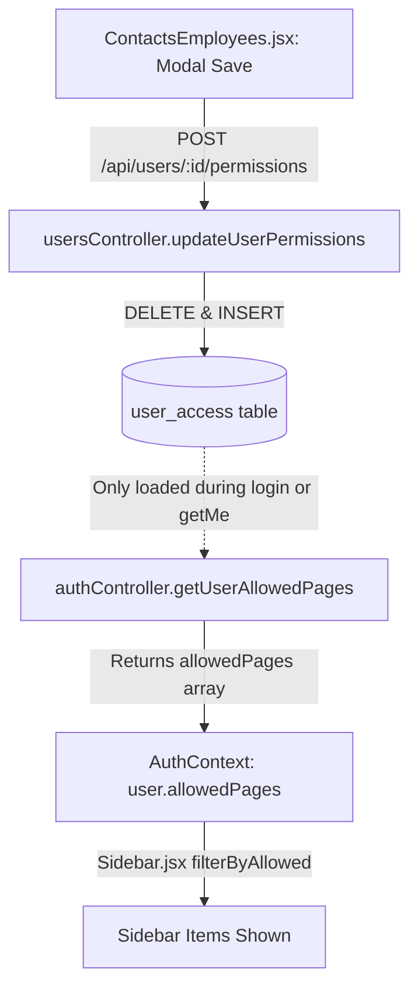

# Tashgheel CRM: Deep-Dive Gap Analysis & Root-Cause Investigation Report
**Investigation Mode:** READ-ONLY (No code modified, no database modified, no migrations executed).  
**Repository State:** `main` @ `d1d10c6` (Clean working tree).

---

## 1. Executive Summary

This investigation analyzed the concrete disconnects across Tashgheel CRM's navigation layer, authorization subsystem, and route mounting architecture.

Three critical findings emerge from the code evidence:
1. **The Navigation Contract is Broken:** Almost all query-parameter-based navigation items in the Sidebar (`/customers?type=lead`, `/deals?tab=reservations`, `/activities?type=site_visit`, `/units-registry?tab=developers`) lead to React components that **never read URL query strings**. Furthermore, `/activities` and `/activities?type=site_visit` are **dead routes** because no `<Route path="activities" ...>` exists in [App.jsx](file:///d:/Tashgheel%20CRM%20Online/frontend/src/App.jsx).
2. **Company Admin Page Permissions Suffer from Multiple Path Mismatches & Stale State:** When a Company Admin assigns permissions in [ContactsEmployees.jsx](file:///d:/Tashgheel%20CRM%20Online/frontend/src/pages/Contacts/ContactsEmployees.jsx), the options use canonical paths (`/contacts/customers`, `/tasks`, `/dashboard`), but the Sidebar filters query strings by exact equality or base paths, and if `user_access` has no entries, the backend falls back to broad role-based arrays. Crucially, when an admin saves permissions, **the target user's browser is never notified**: their permissions are only loaded at login or on `/auth/me` on full reload, remaining completely stale during active sessions.
3. **The Role System Has Only 3 Real User Roles:** Despite comments and legacy permission lists mentioning `finance_manager`, `accountant`, or `sales`, the user creation and editing forms in the UI strictly allow only three roles: `'admin'`, `'manager'`, and `'employee'`.

---

## 2. Complete Sidebar Item Verification

Every row below represents an exact item configured in [frontend/src/components/Layout/Sidebar.jsx](file:///d:/Tashgheel%20CRM%20Online/frontend/src/components/Layout/Sidebar.jsx).

| Sidebar Label | Parent Group | Exact Path | Query String | Conditional Visibility Logic | Matching Route in App.jsx | Route Exists? | Shadowed? | Redirected? | Target Component | Does Component Read Query Params? | Actual Query Param Behavior | Final Verdict |
| :--- | :--- | :--- | :--- | :--- | :--- | :--- | :--- | :--- | :--- | :--- | :--- | :--- |
| **Dashboard** | Core | `/dashboard` | None | `filterByAllowed` | `path="dashboard"` ([App.jsx:149](file:///d:/Tashgheel%20CRM%20Online/frontend/src/App.jsx#L149)) | Yes | No | No | `Dashboard` | N/A | N/A | `WORKS` |
| **Leads** | CRM | `/customers?type=lead` | `type=lead` | `filterByAllowed` | `path="customers"` ([App.jsx:154](file:///d:/Tashgheel%20CRM%20Online/frontend/src/App.jsx#L154)) | Yes | No | No | `Customers` ([Customers.jsx:14](file:///d:/Tashgheel%20CRM%20Online/frontend/src/pages/Customers.jsx#L14)) | **NO** (never reads `type` or query params) | Query ignored, fetches all customers | `WORKS BUT QUERY PARAM IGNORED / SAME PAGE AS CUSTOMERS` |
| **Customers** | CRM | `/customers` | None | `filterByAllowed` | `path="customers"` ([App.jsx:154](file:///d:/Tashgheel%20CRM%20Online/frontend/src/App.jsx#L154)) | Yes | No | No | `Customers` ([Customers.jsx:14](file:///d:/Tashgheel%20CRM%20Online/frontend/src/pages/Customers.jsx#L14)) | N/A | Fetches all customers | `WORKS` |
| **Deals** | CRM | `/deals` | None | `filterByAllowed` | `path="deals"` ([App.jsx:159](file:///d:/Tashgheel%20CRM%20Online/frontend/src/App.jsx#L159)) | Yes | No | No | `Deals` ([Deals.jsx:14](file:///d:/Tashgheel%20CRM%20Online/frontend/src/pages/Deals.jsx#L14)) | N/A | Fetches deals | `WORKS` |
| **Activities** | CRM | `/activities` | None | `filterByAllowed` | **NONE** (No route in [App.jsx](file:///d:/Tashgheel%20CRM%20Online/frontend/src/App.jsx)) | **NO** | N/A | Falls back to catch-all `/` ([App.jsx:389](file:///d:/Tashgheel%20CRM%20Online/frontend/src/App.jsx#L389)) | None | N/A | N/A | **`DEAD / MISSING ROUTE`** |
| **Developers** | Properties | `/units-registry?tab=developers` | `tab=developers` | `isRealEstate` & `filterByAllowed` | `path="units-registry"` ([App.jsx:161](file:///d:/Tashgheel%20CRM%20Online/frontend/src/App.jsx#L161)) | Yes | No | No | `UnitsRegistry` ([UnitsRegistry.jsx:17](file:///d:/Tashgheel%20CRM%20Online/frontend/src/pages/RealEstate/UnitsRegistry.jsx#L17)) | **NO** ([UnitsRegistry.jsx](file:///d:/Tashgheel%20CRM%20Online/frontend/src/pages/RealEstate/UnitsRegistry.jsx) never reads `tab`) | Defaults to unit map/list view | `WORKS BUT QUERY PARAM IGNORED` |
| **Projects** | Properties | `/units-registry?tab=projects` | `tab=projects` | `isRealEstate` & `filterByAllowed` | `path="units-registry"` ([App.jsx:161](file:///d:/Tashgheel%20CRM%20Online/frontend/src/App.jsx#L161)) | Yes | No | No | `UnitsRegistry` | **NO** | Defaults to unit map/list view | `WORKS BUT QUERY PARAM IGNORED` |
| **Phases** | Properties | `/units-registry?tab=phases` | `tab=phases` | `isRealEstate` & `filterByAllowed` | `path="units-registry"` ([App.jsx:161](file:///d:/Tashgheel%20CRM%20Online/frontend/src/App.jsx#L161)) | Yes | No | No | `UnitsRegistry` | **NO** | Defaults to unit map/list view | `WORKS BUT QUERY PARAM IGNORED` |
| **Buildings** | Properties | `/units-registry?tab=buildings` | `tab=buildings` | `isRealEstate` & `filterByAllowed` | `path="units-registry"` ([App.jsx:161](file:///d:/Tashgheel%20CRM%20Online/frontend/src/App.jsx#L161)) | Yes | No | No | `UnitsRegistry` | **NO** | Defaults to unit map/list view | `WORKS BUT QUERY PARAM IGNORED` |
| **Units** | Properties | `/units-registry` | None | `isRealEstate` & `filterByAllowed` | `path="units-registry"` ([App.jsx:161](file:///d:/Tashgheel%20CRM%20Online/frontend/src/App.jsx#L161)) | Yes | No | No | `UnitsRegistry` | N/A | Renders units registry | `WORKS` |
| **Site Visits** | RE Sales | `/activities?type=site_visit` | `type=site_visit` | `isRealEstate` & `filterByAllowed` | **NONE** (No route in [App.jsx](file:///d:/Tashgheel%20CRM%20Online/frontend/src/App.jsx)) | **NO** | N/A | Falls back to catch-all `/` ([App.jsx:389](file:///d:/Tashgheel%20CRM%20Online/frontend/src/App.jsx#L389)) | None | N/A | N/A | **`DEAD / MISSING ROUTE`** |
| **Reservations** | RE Sales | `/deals?tab=reservations` | `tab=reservations` | `isRealEstate` & `filterByAllowed` | `path="deals"` ([App.jsx:159](file:///d:/Tashgheel%20CRM%20Online/frontend/src/App.jsx#L159)) | Yes | No | No | `Deals` ([Deals.jsx:14](file:///d:/Tashgheel%20CRM%20Online/frontend/src/pages/Deals.jsx#L14)) | **NO** ([Deals.jsx](file:///d:/Tashgheel%20CRM%20Online/frontend/src/pages/Deals.jsx) never reads `tab`) | Defaults to general deals table | `WORKS BUT QUERY PARAM IGNORED / SAME PAGE AS DEALS` |
| **Contracts** | RE Sales | `/deals?tab=contracts` | `tab=contracts` | `isRealEstate` & `filterByAllowed` | `path="deals"` ([App.jsx:159](file:///d:/Tashgheel%20CRM%20Online/frontend/src/App.jsx#L159)) | Yes | No | No | `Deals` | **NO** | Defaults to general deals table | `WORKS BUT QUERY PARAM IGNORED / SAME PAGE AS DEALS` |
| **Installments** | RE Sales | `/deals?tab=installments` | `tab=installments` | `isRealEstate` & `filterByAllowed` | `path="deals"` ([App.jsx:159](file:///d:/Tashgheel%20CRM%20Online/frontend/src/App.jsx#L159)) | Yes | No | No | `Deals` | **NO** | Defaults to general deals table | `WORKS BUT QUERY PARAM IGNORED / SAME PAGE AS DEALS` |
| **Commissions** | RE Sales | `/deals?tab=commissions` | `tab=commissions` | `isRealEstate` & `filterByAllowed` | `path="deals"` ([App.jsx:159](file:///d:/Tashgheel%20CRM%20Online/frontend/src/App.jsx#L159)) | Yes | No | No | `Deals` | **NO** | Defaults to general deals table | `WORKS BUT QUERY PARAM IGNORED / SAME PAGE AS DEALS` |
| **Handover** | RE Sales | `/deals?tab=handover` | `tab=handover` | `isRealEstate` & `filterByAllowed` | `path="deals"` ([App.jsx:159](file:///d:/Tashgheel%20CRM%20Online/frontend/src/App.jsx#L159)) | Yes | No | No | `Deals` | **NO** | Defaults to general deals table | `WORKS BUT QUERY PARAM IGNORED / SAME PAGE AS DEALS` |
| **Quotations** | Gen Sales | `/quotations` | None | `!isRealEstate` & `filterByAllowed` | **NONE** (No top-level route in [App.jsx](file:///d:/Tashgheel%20CRM%20Online/frontend/src/App.jsx)) | **NO** | N/A | Falls back to catch-all `/` ([App.jsx:389](file:///d:/Tashgheel%20CRM%20Online/frontend/src/App.jsx#L389)) | None | N/A | N/A | **`DEAD / MISSING ROUTE`** |
| **Sales Orders** | Gen Sales | `/sales/orders` | None | `!isRealEstate` & `filterByAllowed` | `path="sales/orders"` ([App.jsx:193](file:///d:/Tashgheel%20CRM%20Online/frontend/src/App.jsx#L193)) | Yes | No | No | `SalesOrder` | N/A | N/A | `WORKS` |
| **Delivery Notes**| Gen Sales | `/sales/documents` | None | `!isRealEstate` & `filterByAllowed` | `path="sales/documents"` ([App.jsx:194](file:///d:/Tashgheel%20CRM%20Online/frontend/src/App.jsx#L194)) | Yes | No | No | `Documents` | N/A | N/A | `WORKS` |
| **Invoices** | Gen Sales | `/finance?tab=Invoices` | `tab=Invoices` | `!isRealEstate` & `filterByAllowed` | `path="finance"` ([App.jsx:162](file:///d:/Tashgheel%20CRM%20Online/frontend/src/App.jsx#L162)) | Yes | No | No | `Invoices` ([Invoices.jsx:24](file:///d:/Tashgheel%20CRM%20Online/frontend/src/pages/Finance/Invoices.jsx#L24)) | **YES** ([Invoices.jsx:80](file:///d:/Tashgheel%20CRM%20Online/frontend/src/pages/Finance/Invoices.jsx#L80)) | Activates 'Invoices' tab | `WORKS` |
| **Products** | Inventory | `/products` | None | `can('inventory')` & `filterByAllowed` | `path="products"` ([App.jsx:158](file:///d:/Tashgheel%20CRM%20Online/frontend/src/App.jsx#L158)) | Yes | No | No | `Products` | N/A | N/A | `WORKS (MODULE-GATED)` |
| **Warehouses** | Inventory | `/inventory/warehouses` | None | `can('inventory')` & `filterByAllowed` | `path="inventory/warehouses"` ([App.jsx:183](file:///d:/Tashgheel%20CRM%20Online/frontend/src/App.jsx#L183)) | Yes | No | No | `Warehouses` | N/A | N/A | `WORKS (MODULE-GATED)` |
| **Stock Balances** | Inventory | `/inventory/balances` | None | `can('inventory')` & `filterByAllowed` | `path="inventory/balances"` ([App.jsx:186](file:///d:/Tashgheel%20CRM%20Online/frontend/src/App.jsx#L186)) | Yes | No | No | `StockBalances` | N/A | N/A | `WORKS (MODULE-GATED)` |
| **Stock Movements**| Inventory | `/inventory/movements` | None | `can('inventory')` & `filterByAllowed` | `path="inventory/movements"` ([App.jsx:326](file:///d:/Tashgheel%20CRM%20Online/frontend/src/App.jsx#L326)) | Yes | No | No | `InventoryControl` | N/A | N/A | `WORKS (MODULE-GATED)` |
| **Item Cards** | Inventory | `/inventory/item-card` | None | `can('inventory')` & `filterByAllowed` | `path="inventory/item-card"` ([App.jsx:187](file:///d:/Tashgheel%20CRM%20Online/frontend/src/App.jsx#L187)) | Yes | No | No | `ItemCard` | N/A | N/A | `WORKS (MODULE-GATED)` |
| **Suppliers** | Purchasing | `/contacts/vendors` | None | `can('purchasing'\|'inventory')` & `filterByAllowed` | `path="contacts/vendors"` ([App.jsx:156](file:///d:/Tashgheel%20CRM%20Online/frontend/src/App.jsx#L156)) | Yes | No | No | `ContactsVendors` | N/A | N/A | `WORKS (MODULE-GATED)` |
| **Requests** | Purchasing | `/purchases/requests` | None | `can('purchasing'\|'inventory')` & `filterByAllowed` | `path="purchases/requests"` ([App.jsx:179](file:///d:/Tashgheel%20CRM%20Online/frontend/src/App.jsx#L179)) | Yes | No | No | `PurchaseRequests` | N/A | N/A | `WORKS (MODULE-GATED)` |
| **RFQs & Bids** | Purchasing | `/purchases/rfqs` | None | `can('purchasing'\|'inventory')` & `filterByAllowed` | `path="purchases/rfqs"` ([App.jsx:180](file:///d:/Tashgheel%20CRM%20Online/frontend/src/App.jsx#L180)) | Yes | No | No | `RFQs` | N/A | N/A | `WORKS (MODULE-GATED)` |
| **Purchase Orders**| Purchasing | `/purchases/orders` | None | `can('purchasing'\|'inventory')` & `filterByAllowed` | `path="purchases/orders"` ([App.jsx:181](file:///d:/Tashgheel%20CRM%20Online/frontend/src/App.jsx#L181)) | Yes | No | No | `PurchaseOrders` | N/A | N/A | `WORKS (MODULE-GATED)` |
| **Goods Receipts** | Purchasing | `/purchases/receipts` | None | `can('purchasing'\|'inventory')` & `filterByAllowed` | **NONE** (No route in [App.jsx](file:///d:/Tashgheel%20CRM%20Online/frontend/src/App.jsx)) | **NO** | N/A | Falls back to catch-all `/` | None | N/A | N/A | **`DEAD / MISSING ROUTE`** |
| **Supplier Invoices**| Purchasing | `/purchases` | None | `can('purchasing'\|'inventory')` & `filterByAllowed` | `path="purchases"` ([App.jsx:182](file:///d:/Tashgheel%20CRM%20Online/frontend/src/App.jsx#L182)) | Yes | No | No | `Purchases` | N/A | N/A | `WORKS (MODULE-GATED)` |
| **Finance Overview**| Finance | `/finance?tab=Overview` | `tab=Overview` | `filterByAllowed` | `path="finance"` ([App.jsx:162](file:///d:/Tashgheel%20CRM%20Online/frontend/src/App.jsx#L162)) | Yes | No | No | `Invoices` | **YES** | Activates 'Overview' tab | `WORKS` |
| **Finance Invoices**| Finance | `/finance?tab=Invoices` | `tab=Invoices` | `filterByAllowed` | `path="finance"` ([App.jsx:162](file:///d:/Tashgheel%20CRM%20Online/frontend/src/App.jsx#L162)) | Yes | No | No | `Invoices` | **YES** | Activates 'Invoices' tab | `WORKS` |
| **Finance Receipts**| Finance | `/finance?tab=Receipts` | `tab=Receipts` | `filterByAllowed` | `path="finance"` ([App.jsx:162](file:///d:/Tashgheel%20CRM%20Online/frontend/src/App.jsx#L162)) | Yes | No | No | `Invoices` | **YES** | Activates 'Receipts' tab | `WORKS` |
| **Finance Expenses**| Finance | `/finance?tab=Expenses` | `tab=Expenses` | `filterByAllowed` | `path="finance"` ([App.jsx:162](file:///d:/Tashgheel%20CRM%20Online/frontend/src/App.jsx#L162)) | Yes | No | No | `Invoices` | **YES** | Activates 'Expenses' tab | `WORKS` |
| **Finance Customers**| Finance | `/finance?tab=Customers` | `tab=Customers` | `filterByAllowed` | `path="finance"` ([App.jsx:162](file:///d:/Tashgheel%20CRM%20Online/frontend/src/App.jsx#L162)) | Yes | No | No | `Invoices` | **YES** | Activates 'Customers' tab | `WORKS` |
| **Finance Vendors** | Finance | `/finance?tab=Vendors` | `tab=Vendors` | `filterByAllowed` | `path="finance"` ([App.jsx:162](file:///d:/Tashgheel%20CRM%20Online/frontend/src/App.jsx#L162)) | Yes | No | No | `Invoices` | **YES** | Activates 'Vendors' tab | `WORKS` |
| **Finance Treasury**| Finance | `/finance?tab=Treasury` | `tab=Treasury` | `filterByAllowed` | `path="finance"` ([App.jsx:162](file:///d:/Tashgheel%20CRM%20Online/frontend/src/App.jsx#L162)) | Yes | No | No | `Invoices` | **YES** | Activates 'Treasury' tab | `WORKS` |
| **Finance Reports** | Finance | `/finance?tab=Reports` | `tab=Reports` | `filterByAllowed` | `path="finance"` ([App.jsx:162](file:///d:/Tashgheel%20CRM%20Online/frontend/src/App.jsx#L162)) | Yes | No | No | `Invoices` | **YES** | Activates 'Reports' tab | `WORKS` |
| **Meta Lead Ads** | Marketing | `/integrations/meta-forms` | None | `filterByAllowed` | `path="integrations/meta-forms"` ([App.jsx:201](file:///d:/Tashgheel%20CRM%20Online/frontend/src/App.jsx#L201)) | Yes | No | No | `MetaForms` | N/A | N/A | `WORKS` |
| **Campaigns** | Marketing | `/marketing/whatsapp-campaigns` | None | `filterByAllowed` | `path="marketing/whatsapp-campaigns"` ([App.jsx:241](file:///d:/Tashgheel%20CRM%20Online/frontend/src/App.jsx#L241)) | Yes | No | No | `WhatsAppCampaigns` | N/A | N/A | `WORKS` |
| **Lead Sources** | Marketing | `/lead-sources` | None | `filterByAllowed` | **NONE** (No route in [App.jsx](file:///d:/Tashgheel%20CRM%20Online/frontend/src/App.jsx)) | **NO** | N/A | Falls back to catch-all `/` | None | N/A | N/A | **`DEAD / MISSING ROUTE`** |
| **WhatsApp** | Marketing | `/whatsapp-chat` | None | `filterByAllowed` | `path="whatsapp-chat"` ([App.jsx:217](file:///d:/Tashgheel%20CRM%20Online/frontend/src/App.jsx#L217)) | Yes | No | No | `WhatsAppChat` | N/A | N/A | `WORKS` |
| **Tasks** | Utilities | `/tasks` | None | `filterByAllowed` | `path="tasks"` ([App.jsx:160](file:///d:/Tashgheel%20CRM%20Online/frontend/src/App.jsx#L160)) | Yes | No | No | `Tasks` | N/A | N/A | `WORKS` |
| **Files** | Utilities | `/files` | None | `filterByAllowed` | `path="files"` ([App.jsx:349](file:///d:/Tashgheel%20CRM%20Online/frontend/src/App.jsx#L349)) | Yes | No | No | `Files` | N/A | N/A | `WORKS` |
| **Automation** | Utilities | `/automation` | None | `can('automation')` & `filterByAllowed` | `path="automation"` ([App.jsx:334](file:///d:/Tashgheel%20CRM%20Online/frontend/src/App.jsx#L334)) | Yes | No | No | `AutomationControl` | N/A | N/A | `WORKS (MODULE-GATED)` |
| **Reports** | Utilities | `/reports` | None | `filterByAllowed` | `path="reports"` ([App.jsx:176](file:///d:/Tashgheel%20CRM%20Online/frontend/src/App.jsx#L176)) | Yes | **YES** | Redirects to `/erp/reports` | `FinancialReports` (ERP) | N/A | Shadowed: line 350 `<Reports />` unreachable | **`SHADOWED / REDIRECTS TO PARKED ERP`** |
| **System Logs** | Utilities | `/logs` | None | `user.role === 'admin'` | `path="logs"` ([App.jsx:352](file:///d:/Tashgheel%20CRM%20Online/frontend/src/App.jsx#L352)) | Yes | No | No | `Logs` | N/A | N/A | `WORKS (ADMIN ONLY)` |
| **Admin Settings** | Utilities | `/settings` | None | `user.role === 'admin'` | `path="settings"` ([App.jsx:360](file:///d:/Tashgheel%20CRM%20Online/frontend/src/App.jsx#L360)) | Yes | No | No | `Settings` | N/A | N/A | `WORKS (ADMIN ONLY)` |
| **Billing** | Utilities | `/billing` | None | `filterByAllowed` | `path="billing"` ([App.jsx:153](file:///d:/Tashgheel%20CRM%20Online/frontend/src/App.jsx#L153)) | Yes | No | No | `Billing` | N/A | N/A | `WORKS` |

---

## 3. Query Parameter Audit

| Sidebar Item | URL | Parameter | Target Component | Parameter Read? | Parameter Used? | Result |
| :--- | :--- | :--- | :--- | :--- | :--- | :--- |
| **Leads** | `/customers?type=lead` | `type=lead` | `Customers.jsx` | **NO** ([Customers.jsx:14-120](file:///d:/Tashgheel%20CRM%20Online/frontend/src/pages/Customers.jsx#L14-L120)) | Ignored | Renders standard Customers list. Lead distinction is completely invisible. |
| **Site Visits** | `/activities?type=site_visit` | `type=site_visit` | (None - Route missing) | **NO** | Missing Route | Hits 404 / catch-all redirect to `/`. |
| **Reservations** | `/deals?tab=reservations` | `tab=reservations` | `Deals.jsx` | **NO** ([Deals.jsx:14-136](file:///d:/Tashgheel%20CRM%20Online/frontend/src/pages/Deals.jsx#L14-L136)) | Ignored | Renders default deals pipeline table. Tab parameter is discarded. |
| **Contracts** | `/deals?tab=contracts` | `tab=contracts` | `Deals.jsx` | **NO** ([Deals.jsx:14-136](file:///d:/Tashgheel%20CRM%20Online/frontend/src/pages/Deals.jsx#L14-L136)) | Ignored | Renders default deals pipeline table. |
| **Installments** | `/deals?tab=installments` | `tab=installments` | `Deals.jsx` | **NO** ([Deals.jsx:14-136](file:///d:/Tashgheel%20CRM%20Online/frontend/src/pages/Deals.jsx#L14-L136)) | Ignored | Renders default deals pipeline table. |
| **Commissions** | `/deals?tab=commissions` | `tab=commissions` | `Deals.jsx` | **NO** ([Deals.jsx:14-136](file:///d:/Tashgheel%20CRM%20Online/frontend/src/pages/Deals.jsx#L14-L136)) | Ignored | Renders default deals pipeline table. |
| **Handover** | `/deals?tab=handover` | `tab=handover` | `Deals.jsx` | **NO** ([Deals.jsx:14-136](file:///d:/Tashgheel%20CRM%20Online/frontend/src/pages/Deals.jsx#L14-L136)) | Ignored | Renders default deals pipeline table. |
| **Developers** | `/units-registry?tab=developers` | `tab=developers` | `UnitsRegistry.jsx` | **NO** ([UnitsRegistry.jsx:17-60](file:///d:/Tashgheel%20CRM%20Online/frontend/src/pages/RealEstate/UnitsRegistry.jsx#L17-L60)) | Ignored | Renders default unit grid/map. |
| **Projects** | `/units-registry?tab=projects` | `tab=projects` | `UnitsRegistry.jsx` | **NO** | Ignored | Renders default unit grid/map. |
| **Phases** | `/units-registry?tab=phases` | `tab=phases` | `UnitsRegistry.jsx` | **NO** | Ignored | Renders default unit grid/map. |
| **Buildings** | `/units-registry?tab=buildings` | `tab=buildings` | `UnitsRegistry.jsx` | **NO** | Ignored | Renders default unit grid/map. |
| **Finance Tabs** | `/finance?tab=...` (8 items) | `tab=Overview|Invoices|Receipts|...` | `Invoices.jsx` | **YES** ([Invoices.jsx:80](file:///d:/Tashgheel%20CRM%20Online/frontend/src/pages/Finance/Invoices.jsx#L80)) | **YES** (`setActiveTab(qTab)`) | **Properly updates UI tab.** (Only query-string link in the system that actually works!) |

---

## 4. Leads vs Customers: Root Cause

### Frontend Evidence:
- In [frontend/src/components/Layout/Sidebar.jsx:37-38](file:///d:/Tashgheel%20CRM%20Online/frontend/src/components/Layout/Sidebar.jsx#L37-L38):
  ```javascript
  { name: 'Leads',     path: '/customers?type=lead' },
  { name: 'Customers', path: '/customers' }
  ```
- In [frontend/src/pages/Customers.jsx:14-115](file:///d:/Tashgheel%20CRM%20Online/frontend/src/pages/Customers.jsx#L14-L115):
  - `Customers.jsx` does **not import** `useSearchParams` or `useLocation`.
  - It does **not inspect** `window.location.search`.
  - It triggers `fetchCustomers()` via `useData()`, which sends `GET /api/customers` **without any query parameters** ([DataContext.jsx:58](file:///d:/Tashgheel%20CRM%20Online/frontend/src/context/DataContext.jsx#L58)).

### Backend Evidence:
- In [controllers/customersController.js:105-108](file:///d:/Tashgheel%20CRM%20Online/controllers/customersController.js#L105-L108):
  - The backend supports `req.query.entity_type` (filtering `c.entity_type = 'customer' | 'vendor' | 'broker'`).
  - It also stores a column `status` which defaults to `'lead'` ([customersController.js:225](file:///d:/Tashgheel%20CRM%20Online/controllers/customersController.js#L225)), but `getCustomers` **does not have a filter for `req.query.status` or `req.query.type`!**

### Conclusion:
Leads and Customers use the exact same underlying table (`customers`). The Sidebar attempted to create two distinct entry points by passing `?type=lead`, but neither the frontend page nor the backend API endpoint ever implemented parameter reading or filtering. Hence, clicking "Leads" and "Customers" triggers identical code and renders identical rows.

---

## 5. HR Route & Sidebar Audit

In [frontend/src/App.jsx](file:///d:/Tashgheel%20CRM%20Online/frontend/src/App.jsx), extensive real HR components are mounted, but **none appear in `Sidebar.jsx`**:

| HR Route | Component | Exists? | Real Page / Stub | Module Guard in Backend? | Module Key | Sidebar Entry Exists? | Recommended Sidebar Label |
| :--- | :--- | :--- | :--- | :--- | :--- | :--- | :--- |
| `/hr/dashboard` | `AttendanceAdmin` ([App.jsx:273](file:///d:/Tashgheel%20CRM%20Online/frontend/src/App.jsx#L273)) | Yes | **Real Page** | Yes (`/api/hr` guarded by `moduleGuard('hr')`) | `hr` | **NO** | HR Dashboard |
| `/hr/my-attendance` | `Attendance` ([App.jsx:266](file:///d:/Tashgheel%20CRM%20Online/frontend/src/App.jsx#L266)) | Yes | **Real Page** | Yes | `hr` | **NO** | My Attendance |
| `/hr/my-requests` | `MyRequests` ([App.jsx:268](file:///d:/Tashgheel%20CRM%20Online/frontend/src/App.jsx#L268)) | Yes | **Real Page** | Yes | `hr` | **NO** | My Requests |
| `/hr/approvals` | `ApprovalCenter` ([App.jsx:281](file:///d:/Tashgheel%20CRM%20Online/frontend/src/App.jsx#L281)) | Yes | **Real Page** | Yes | `hr` | **NO** | Approvals Center |
| `/hr/payroll` | `PayrollEngine` ([App.jsx:289](file:///d:/Tashgheel%20CRM%20Online/frontend/src/App.jsx#L289)) | Yes | **Real Page** | Yes | `hr` | **NO** | Payroll Engine |
| `/hr/shifts` | `Shifts` ([App.jsx:313](file:///d:/Tashgheel%20CRM%20Online/frontend/src/App.jsx#L313)) | Yes | **Real Page** | Yes | `hr` | **NO** | Shifts |
| `/hr/devices` | `AttendanceDevices` ([App.jsx:321](file:///d:/Tashgheel%20CRM%20Online/frontend/src/App.jsx#L321)) | Yes | **Real Page** | Yes | `hr` | **NO** | Attendance Devices |
| `/hr/activity-definition` | `ActivityDefinition` ([App.jsx:297](file:///d:/Tashgheel%20CRM%20Online/frontend/src/App.jsx#L297)) | Yes | **Real Page** | Yes | `hr` | **NO** | Activity Types |
| `/hr/activity-balance` | `ActivityBalance` ([App.jsx:305](file:///d:/Tashgheel%20CRM%20Online/frontend/src/App.jsx#L305)) | Yes | **Real Page** | Yes | `hr` | **NO** | Activity Balances |

---

## 6. Reports Route Collision

In [frontend/src/App.jsx](file:///d:/Tashgheel%20CRM%20Online/frontend/src/App.jsx):
- **Line 176:** `<Route path="reports" element={<Navigate to="/erp/reports" replace />} />`
- **Line 350:** `<Route path="reports" element={<Reports />} />`

Because React Router matches the first declared path under the parent route:
1. When a user clicks `/reports` in the Sidebar, Line 176 catches it first and redirects to `/erp/reports`.
2. `/erp/reports` loads `FinancialReports.jsx` (the ERP general ledger report).
3. In `server.js`, `/api/erp/reports` is disabled (`code: 'ERP_ACCOUNTING_DISABLED'`) unless `ENABLE_ERP_ACCOUNTING='true'`.
4. As a result, the CRM Reports component on line 350 is permanently shadowed and completely unreachable.

---

## 7. Permission Lifecycle (End-to-End Trace)



### Trace Details:
1. **Admin UI:** Company Admin selects pages in `ContactsEmployees.jsx:287` and sends:
   ```json
   POST /api/users/:id/permissions
   { "allowedPages": ["/contacts/customers", "/tasks", "/dashboard"] }
   ```
2. **Backend:** Handled by [usersController.js:169-181](file:///d:/Tashgheel%20CRM%20Online/controllers/usersController.js#L169-L181):
   - Deletes existing rows from `user_access`.
   - Inserts rows: `(user_id, page_path, can_access)`.
3. **Storage Disconnect:** Stored paths are canonical (`/contacts/customers`), whereas Sidebar items often use `/customers` or `/customers?type=lead`.
4. **Session Stale State:** When permissions are saved, **no event, websocket, or cache-busting notification is sent**. The target user's session in `localStorage` / `AuthContext` remains completely unchanged until they manually log out and log back in, or trigger a full page refresh that hits `GET /api/auth/me`.
5. **Fallback Override:** If `user_access` has no records, [authController.js:204-232](file:///d:/Tashgheel%20CRM%20Online/controllers/authController.js#L204-L232) auto-populates a hardcoded default list of 9–40 pages based on `user.role`!

---

## 8. Backend Authorization vs Sidebar Visibility

| Feature | Sidebar Path | Stored in `user_access` | Backend Route Middleware | Enforced at Backend? |
| :--- | :--- | :--- | :--- | :--- |
| Customers | `/customers` | `/contacts/customers` | None (any authenticated user) | **NO** (API accessible by anyone) |
| Deals | `/deals` | `/deals` | None (any authenticated user) | **NO** |
| Finance | `/finance?tab=...` | `/finance` | None (any authenticated user) | **NO** |
| Voucher Cancel | N/A (Action inside Finance) | None | `requirePermission('voucher.cancel')` | **YES** |
| Voucher Create | N/A (Action inside Finance) | None | None | **NO** |
| Settings | `/settings` | `/settings` | `authorize(['admin'])` | **YES** |
| System Logs | `/logs` | `/logs` | `authorize(['admin'])` | **YES** |
| HR Endpoints | N/A | Various `/hr/*` | `moduleGuard('hr')` | **YES (Plan level only)** |

*Security finding:* Hiding an item in the Sidebar only removes the link from the UI. The backend REST APIs for customers, deals, products, and vouchers do not invoke `checkPageAccess()`, meaning any employee can query the data directly with their JWT token.

---

## 9. Authorization Systems Inventory

| System Name | Purpose | Source Table / Store | Consumer | Scope | Frontend or Backend |
| :--- | :--- | :--- | :--- | :--- | :--- |
| **PBAC (`user_access`)** | Page-level access | `user_access` | `Sidebar.jsx`, `authController` | User | Both |
| **RBAC (`users.role`)** | High-level role guard | `users.role` | `roleMiddleware.authorize`, `App.jsx` | User | Both |
| **Financial RBAC** | Fine-grained money permissions | `financial_permissions` / Defaults | `middleware/financialPermission.js` | User | Backend only |
| **Module Entitlements** | Plan feature gating | `plans.modules`, `subscriptions` | `moduleGuard.js`, `useModule.js` | Tenant | Both |
| **Template Guard** | Business vertical workflow | `tenants.template_name` | `templateGuard.js`, `Sidebar.jsx` | Tenant | Both |

---

## 10. Verified Role Matrix

| Role String | Where Defined | Can Be Assigned? | UI Selectable? | Used In Backend? | Used In Frontend? |
| :--- | :--- | :--- | :--- | :--- | :--- |
| `'admin'` | [server.js:302](file:///d:/Tashgheel%20CRM%20Online/server.js#L302), [ContactsEmployees.jsx:459](file:///d:/Tashgheel%20CRM%20Online/frontend/src/pages/Contacts/ContactsEmployees.jsx#L459) | Yes | **Yes** | Yes (all controllers) | Yes |
| `'manager'` | [ContactsEmployees.jsx:458](file:///d:/Tashgheel%20CRM%20Online/frontend/src/pages/Contacts/ContactsEmployees.jsx#L458) | Yes | **Yes** | Yes (`usersController`, `dashboardController`) | Yes |
| `'employee'` | [ContactsEmployees.jsx:457](file:///d:/Tashgheel%20CRM%20Online/frontend/src/pages/Contacts/ContactsEmployees.jsx#L457) | Yes | **Yes** | Yes (`usersController`, `dashboardController`) | Yes |
| `'sales'` | [routes/userRoutes.js:14](file:///d:/Tashgheel%20CRM%20Online/routes/userRoutes.js#L14) (comment/legacy) | No | **NO** | Mentioned in route array | No |
| `'user'` | [routes/userRoutes.js:14](file:///d:/Tashgheel%20CRM%20Online/routes/userRoutes.js#L14) (legacy default) | No | **NO** | Mentioned in route array | No |
| `'finance_manager'`| [financialPermission.js:30](file:///d:/Tashgheel%20CRM%20Online/middleware/financialPermission.js#L30) | No | **NO** | Fallback map only | No |
| `'accountant'` | [financialPermission.js:48](file:///d:/Tashgheel%20CRM%20Online/middleware/financialPermission.js#L48) | No | **NO** | Fallback map only | No |

*Conclusion:* The real, assignable system roles today are strictly: **`admin`**, **`manager`**, and **`employee`**.

---

## 11. Financial Action Permission Inventory

| Action | Current Guard | Permission Name | Role Guard | Admin Bypass? | Tenant Scoped? | Risk |
| :--- | :--- | :--- | :--- | :--- | :--- | :--- |
| **Voucher Cancel** | `requirePermission('voucher.cancel')` | `voucher.cancel` | `admin`, `finance_manager` | Yes | Yes | **LOW (Properly Secured)** |
| **Voucher Create** | Generic JWT Auth | None | None | Yes | Yes | **HIGH (Any employee can issue vouchers)** |
| **Installment Payment**| Generic JWT Auth | None | None | Yes | Yes | **HIGH (Any user can mark installment paid)** |
| **Invoice Create** | Generic JWT Auth | None | None | Yes | Yes | **MEDIUM** |
| **Invoice Cancel/Delete**| `authorize(['admin'])` | None | `admin` | Yes | Yes | **MEDIUM** |
| **Expense Create** | Generic JWT Auth | None | None | Yes | Yes | **MEDIUM** |

---

## 12. Root Causes Summary

- **Root Cause 1: Broken UI Query Parameter Contracts:** Sidebar items pass query parameters (`?type=lead`, `?tab=reservations`) that target React components never inspect or bind to internal tab states.
- **Root Cause 2: Missing Route Definitions in `App.jsx`:** Links for `/activities` and `/lead-sources` are rendered in the Sidebar without any corresponding `<Route>` in `App.jsx`.
- **Root Cause 3: Path Format Asymmetry in RBAC:** Admin permission assignment emits `/contacts/customers`, while Sidebar filters look for `/customers`.
- **Root Cause 4: Asynchronous Permission Stale State:** Changes to `user_access` in the database do not invalidate or refresh active JWTs or frontend React state until manual re-login.
- **Root Cause 5: Route Shadowing in `App.jsx`:** Catch-all redirects to parked ERP modules (`/reports` $\rightarrow$ `/erp/reports`) precede and shadow valid CRM pages.
- **Root Cause 6: Phantom Roles in Financial Configuration:** Backend financial permission fallback dictionaries reference non-existent roles (`accountant`, `finance_manager`, `sales`) that cannot be assigned in the UI.

---

## 13. Main Branch Protection Status

`Branch protection must be configured in the Git hosting provider before implementation begins.`  
(Git hosting API credentials or repository administration rules are external to this execution shell.)

---

## 14. Loading-State & Module Entitlement Defaults

- **Loading Race Condition:** In [frontend/src/context/AuthContext.jsx](file:///d:/Tashgheel%20CRM%20Online/frontend/src/context/AuthContext.jsx), `user` is initially `null` and `subscription` is loaded asynchronously. During the initial render cycle before `/auth/me` resolves, `user?.template_name` is `undefined`, causing template-specific items to momentarily hide or flash.
- **Default Plan Module Keys:**
  In [scripts/saas-migration.js:42-59](file:///d:/Tashgheel%20CRM%20Online/scripts/saas-migration.js#L42-L59) and [controllers/plansController.js:59](file:///d:/Tashgheel%20CRM%20Online/controllers/plansController.js#L59):
  - **Basic Plan (Default):** `crm: true`, `finance: true`, `hr: false`, `inventory: false`, `automation: false`.
  - **Pro Plan:** `crm: true`, `finance: true`, `hr: true`, `inventory: true`, `automation: false`.
  - **Enterprise Plan:** `crm: true`, `finance: true`, `hr: true`, `inventory: true`, `automation: true`.

---
*Report generated strictly read-only without modifying any application or database files.*
